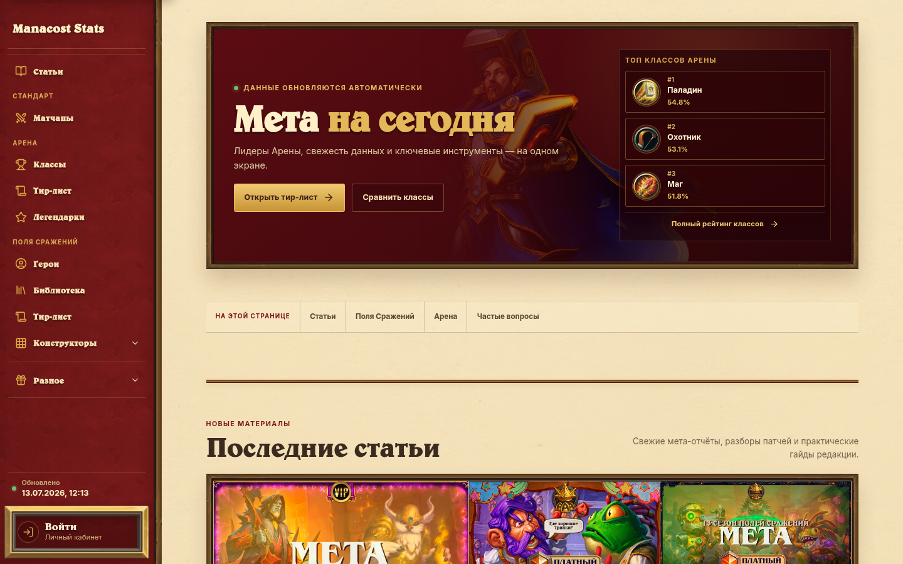
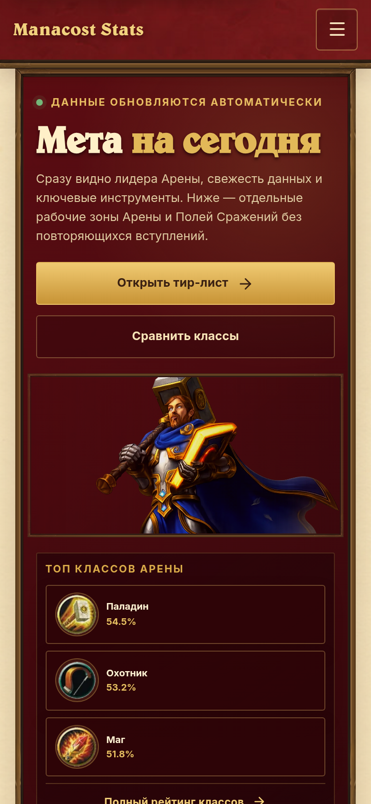
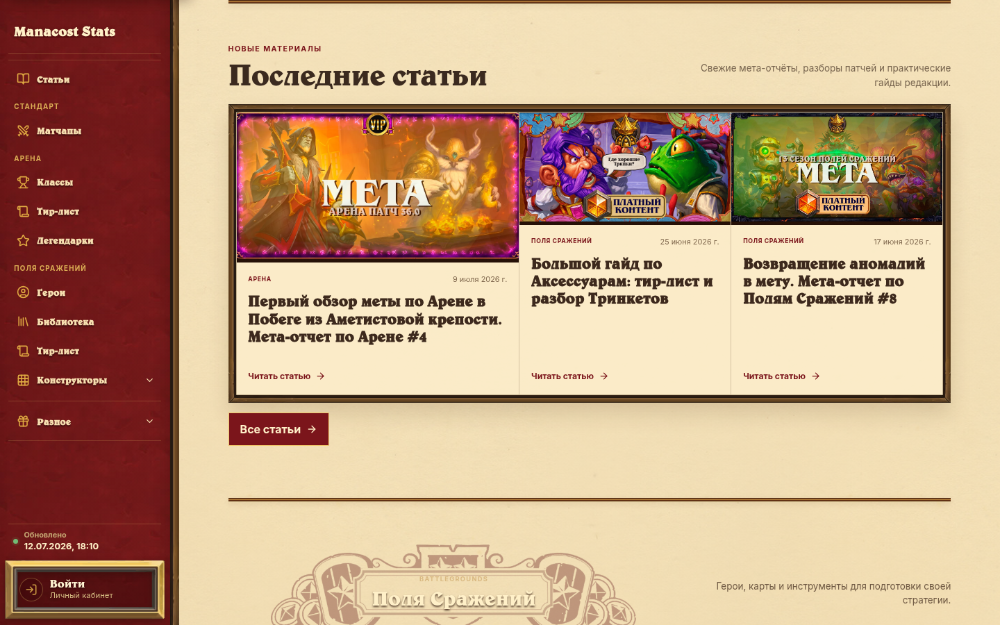

<!-- markdownlint-disable MD013 MD033 MD041 -->

<p align="center">
  
</p>

<h1 align="center">Manacost Arena</h1>

<p align="center">
  <strong>Мета Hearthstone без таблиц, которые приходится расшифровывать.</strong>
</p>

<p align="center">
  Русскоязычная production-платформа для Арены и Полей Сражений:<br>
  тир-листы, винрейты, библиотека карт, гайды и игровые конструкторы.
</p>

<p align="center">
  <a href="https://arena.hs-manacost.ru"><strong>Открыть сайт</strong></a> ·
  <a href="#быстрый-старт">Быстрый старт</a> ·
  <a href="STABILIZATION.md">Надёжность</a> ·
  <a href="assets.md">Дизайн и ассеты</a> ·
  <a href="DEPLOYMENT.md">Деплой</a> ·
  <a href="CONTRIBUTING.md">Вклад в проект</a> ·
  <a href="SECURITY.md">Безопасность</a>
</p>

<p align="center">
  <a href="https://github.com/Zulut30/manacost-arena/actions/workflows/ci.yml">
    
  </a>
  <a href="https://github.com/Zulut30/manacost-arena/actions/workflows/codeql.yml">
    
  </a>
  <a href="https://github.com/Zulut30/manacost-arena/actions/workflows/gitleaks.yml">
    
  </a>
  <a href="https://github.com/Zulut30/manacost-arena/actions/workflows/osv-scanner.yml">
    
  </a>
  <a href="https://github.com/Zulut30/manacost-arena/actions/workflows/trivy.yml">
    
  </a>
  <a href="https://github.com/Zulut30/manacost-arena/actions/workflows/scorecard.yml">
    
  </a>
</p>

<p align="center">
  <a href="https://arena.hs-manacost.ru/api/health/ready">
    
  </a>
  <a href="https://react.dev">
    
  </a>
  <a href="https://www.typescriptlang.org/">
    
  </a>
  <a href="https://nodejs.org/">
    
  </a>
</p>

<table>
  <tr>
    <td width="72%">
      
    </td>
    <td width="28%">
      
    </td>
  </tr>
  <tr>
    <td align="center"><strong>Desktop workspace</strong></td>
    <td align="center"><strong>Mobile, 390 px</strong></td>
  </tr>
</table>

> Один репозиторий объединяет React-интерфейс, Express API, durable snapshots,
> immutable-релизы и многоуровневый desktop/mobile/security quality gate.

## Зачем этот проект

Manacost Arena превращает разрозненные игровые данные в один быстрый рабочий
экран: перед драфтом можно проверить лидирующие классы и карты, во время игры —
открыть нужный тир-лист, а для Полей Сражений — перейти к героям, библиотеке или
конструктору стратегии. Редакционные мета-отчёты находятся рядом со статистикой,
поэтому контекст не теряется между несколькими сервисами.

- **Актуальные данные:** классы, карты и легендарные группы, источник и время
  обновления, durable snapshots при сбое upstream.
- **Игровые инструменты:** герои, BG-библиотека, конструкторы, поиск, фильтры,
  mobile lightbox, профиль, статьи, гайды и конкурсы.
- **Production-контур:** immutable releases, автоматический rollback, security
  contracts, encrypted backup, desktop/mobile E2E и zero-axe gate.

| Быстрый вход | Ссылка |
| --- | --- |
| Арена: винрейты классов | [Открыть `/classes`](https://arena.hs-manacost.ru/classes) |
| Арена: тир-лист карт | [Открыть `/tierlist`](https://arena.hs-manacost.ru/tierlist) |
| Поля Сражений: герои | [Открыть `/heroes`](https://arena.hs-manacost.ru/heroes) |
| Поля Сражений: библиотека | [Открыть `/library`](https://arena.hs-manacost.ru/library) |
| Состояние production | [Readiness API](https://arena.hs-manacost.ru/api/health/ready) |

## О проекте

Manacost Arena объединяет актуальную статистику, редакционные материалы и
инструменты подготовки к игре. На одном сайте доступны тир-листы карт и
классов Арены, группы легендарок, герои и библиотека Полей Сражений,
конструкторы стратегий, статьи, гайды и персональный профиль.

Интерфейс построен вокруг визуального языка Hearthstone: пергамент, дерево,
красные тавернные поверхности и аккуратный фиолетовый акцент `#4A2F66`.
Desktop и mobile проходят один и тот же набор функциональных, адаптивных и
accessibility-проверок перед каждым релизом.

## Интерфейс в деталях



Скриншоты снимаются прямо с production в desktop и mobile viewport. Их можно
воспроизвести одной командой:

```bash
npm run docs:screenshots
```

## Что внутри

| Арена | Поля Сражений | Платформа |
| --- | --- | --- |
| Винрейты классов | Герои и их профили | Статьи и мета-отчёты |
| Тир-листы карт | Библиотека и архив | Архив гайдов и галерея |
| Группы легендарок | Тир-листы меты | Telegram/Boosty-профиль |
| Матчапы и аналитика | Конструкторы стратегий | Редакционная admin-панель |

Интерфейс работает от 320 px, проходит 200% reflow и forced-colors
проверку. Клавиатурная навигация, scroll lock модальных окон и
axe-аудит входят в обязательный release gate.

## Архитектура

```text
Browser
  │
  ├── React 19 + TypeScript + Vite
  │     ├── route-level code splitting
  │     ├── pre-rendered route shells
  │     └── responsive Hearthstone UI
  │
  └── /api/*
        ├── Express API (compiled TypeScript)
        ├── signed authentication and CSRF boundary
        ├── Redis-assisted caches and durable snapshots
        ├── isolated scraper publication
        └── health, readiness, freshness and metrics contracts

Nginx → immutable release → systemd service
             │
             ├── atomic switch and automatic rollback
             └── encrypted backup and restore drills
```

Основные каталоги:

```text
src/components/       общие UI-компоненты
src/features/         страницы и функциональные модули
src/styles/           общие токены и ограниченные shared-стили
server/               API, auth, кэширование и публикация данных
scripts/              QA, бюджеты, релизы, мониторинг и recovery
tests/                unit, contract, security и deployment tests
deploy/               systemd units и инфраструктурные шаблоны
public/               локальные игровые и декоративные ассеты
docs/screenshots/     актуальные изображения для GitHub
```

## Качество и безопасность

Каждое изменение проходит единый обязательный gate:

```bash
npm run verify:ci
```

Он включает:

- TypeScript typecheck и архитектурные ограничения;
- unit, HTTP contract, auth, CSRF, backup и deployment tests;
- production-сборку frontend и server;
- бюджеты JavaScript/CSS и контроль роста `!important`;
- desktop/mobile E2E с mocked-подпиской;
- axe accessibility audit, 200% reflow, keyboard и modal scroll-lock;
- проверку документации и дизайн-системы.

Отдельные GitHub-проверки защищают цепочку поставки и репозиторий:

- **CodeQL и Semgrep** ищут уязвимые потоки данных и небезопасные конструкции;
- **Gitleaks** проверяет полную Git-историю и рабочее дерево на секреты;
- **Dependabot, OSV-Scanner и Dependency Review** контролируют lockfile,
  новые зависимости, известные уязвимости, лицензии и здоровье пакетов;
- **Trivy** блокирует `HIGH`/`CRITICAL` уязвимости и ошибки конфигурации;
- **OpenSSF Scorecard** оценивает security posture репозитория;
- **Sentry** опционально собирает очищенные от PII frontend/server ошибки.

После выкладки production дополнительно проверяется командами:

```bash
node scripts/production-monitor.mjs
npm run qa:e2e
```

Подробные SLO, stop-the-line правила и текущий прогресс находятся в
[STABILIZATION.md](STABILIZATION.md).

## Стек и инструменты

| Контур | Используемые инструменты |
| --- | --- |
| Интерфейс | React 19, TypeScript strict, Vite 6, Tailwind CSS 4, Lucide, responsive CSS |
| API и данные | Node.js 22, Express, Redis, SQLite, Sharp, Puppeteer, node-cron, Hearthstone deckstrings |
| Тестирование | Node test runner, tsx, fast-check, Puppeteer E2E, axe-core, browser contract tests |
| Качество кода | TypeScript, React Doctor, Knip, markdownlint, design.md, архитектурные и bundle-budget проверки |
| AppSec | CodeQL, Semgrep CE, Gitleaks, Trivy, GitHub Private Vulnerability Reporting |
| Supply chain | Dependabot, OSV-Scanner, Dependency Review, npm audit, OpenSSF Scorecard |
| Наблюдаемость | Sentry React/Node SDK, Sentry MCP, Chrome DevTools MCP, readiness/metrics и production monitor |
| Delivery | GitHub Actions, immutable artifacts, Nginx, systemd, atomic symlink switch, rollback и encrypted backups |
| Контекст команды | Notion для задач, Miro для схем и UX-контекста, Codex/Claude post-push review |

Все security Actions закреплены полными commit SHA, а чувствительные интеграции
остаются выключенными без явной серверной конфигурации. Подробности и команды
для AI-агентов собраны в [docs/agent-tooling.md](docs/agent-tooling.md).

## Быстрый старт

Требуются Node.js 22+, npm и Chromium/Google Chrome для browser QA и scraper.

```bash
git clone https://github.com/Zulut30/manacost-arena.git
cd manacost-arena
npm ci
cp .env.example .env
npm run dev
```

Frontend доступен на `http://localhost:3000`, API запускается рядом в dev
режиме. Без внешних ключей используются локальные snapshots; интеграции и
публикация свежих данных требуют соответствующих переменных из `.env.example`.

Полезные команды:

| Команда | Назначение |
| --- | --- |
| `npm run dev` | Frontend и API в watch-режиме |
| `npm run build` | Production frontend, server и pre-render |
| `npm test` | Unit и contract test suite |
| `npm run qa:e2e` | Полный desktop/mobile browser QA |
| `npm run budget` | Контроль размеров JS и CSS |
| `npm run scrape` | Ручной запуск scraper в разработке |
| `npm run security:gitleaks` | Локальная проверка истории и рабочего дерева |
| `npm run security:semgrep` | Статический анализ изменённых JS/TS-файлов |
| `npm run quality:knip` | Проверка dependency-контуров |
| `npm run verify:ci` | Полный обязательный gate |

## Production-релиз

Production использует immutable-артефакты, атомарное переключение symlink,
readiness gate и автоматический rollback. Краткий ручной сценарий:

```bash
sudo -u koloda npm run verify:ci
sha=$(git rev-parse HEAD)
artifact="/tmp/hs-arena-release-$sha"
npm run release:create -- --output="$artifact" --sha="$sha"
sudo scripts/deploy-release.sh "$artifact"
```

Полная инструкция, включая recovery, encrypted backup и off-site replication,
находится в [DEPLOYMENT.md](DEPLOYMENT.md).

## Участие в проекте

Ошибки и идеи принимаются через
[структурированные GitHub Issues](https://github.com/Zulut30/manacost-arena/issues/new/choose).
Перед pull request прочитайте [CONTRIBUTING.md](CONTRIBUTING.md) и выполните
`npm run verify:ci`. Уязвимости нужно отправлять только через
[приватный security advisory](https://github.com/Zulut30/manacost-arena/security/advisories/new).

История пользовательских изменений ведётся в [CHANGELOG.md](CHANGELOG.md).

## Дизайн-система

[assets.md](assets.md) содержит цветовые токены, типографику, CSS-рецепты рам,
правила mobile-декора и полный каталог production URL всех ассетов. Документ
можно использовать как переносимый контракт при интеграции дизайна в другой
проект.

## Источники и права

Статистика агрегируется из игровых и аналитических источников, указанных в
интерфейсе рядом с соответствующими наборами данных. Hearthstone и связанные
изображения принадлежат Blizzard Entertainment. Репозиторий не является
официальным продуктом Blizzard.

Исходный код опубликован без отдельного файла лицензии; отсутствие лицензии не
означает разрешение на копирование или распространение. По вопросам проекта:
[Manacost в Telegram](https://t.me/manacost_ru).

Сделано командой Manacost для русскоязычного сообщества Hearthstone.
