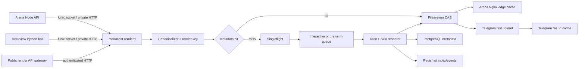

<!-- markdownlint-disable MD013 MD024 MD031 MD040 MD060 -->

# Технический план единой платформы изображений колод

## 1. Назначение

Документ переводит ADR-0002 в последовательный план реализации. Результат должен одинаково обслуживать:

- страницы и редактор дизайна `arena.hs-manacost.ru`;
- Deckview Telegram bot, личные диалоги, группы и комментарии;
- публичный API генерации изображений;
- пакетный предрендер сотен колод после импорта или обновления карт.

Главное правило: пользовательский HTTP/Telegram-запрос не должен выполнять работу, которую можно было выполнить при сохранении данных. Для Arena нормальный путь — заранее готовый immutable URL. Для Telegram нормальный путь — готовый `artifact_hash` и сохранённый `file_id`.

## 2. Границы проекта

### Входит в проект

- единая канонизация колоды, включая sideboard;
- единая канонизация эффективного дизайна пользователя/чата;
- общий render key и content-addressed storage;
- холодный CPU renderer;
- web- и Telegram-варианты;
- предрендер, singleflight, очереди и dependency invalidation;
- адаптеры Arena и Telegram;
- API-key authentication, rate limits и quotas публичного API;
- метрики, нагрузочные тесты, rollout и rollback.

### Не входит в первый релиз

- GPU-render farm;
- генерация дизайна через браузер/Puppeteer;
- SaaS-композиция 30–40 отдельных карт;
- перенос исходных карточных данных в новую master-БД;
- автоматическая замена текущего интерактивного списка HSReplay на Arena: картинка добавляется как быстрый preview/download, интерактивный список может остаться.

## 3. Целевая схема



## 4. Сервисы

### 4.1 `manacost-renderd`

Один долгоживущий Rust-процесс владеет:

- канонизацией render spec;
- in-process LRU подготовленных карт и пользовательских ресурсов;
- singleflight map для запросов одного экземпляра;
- bounded worker pools;
- композицией master;
- созданием вариантов;
- атомарной записью CAS;
- чтением/записью metadata cache.

Предлагаемый Rust workspace:

```text
manacost-renderer/
├── Cargo.toml
├── crates/
│   ├── render-model/       # типы API и canonical serialization
│   ├── render-key/         # JCS + SHA-256
│   ├── card-registry/      # card revisions and local paths
│   ├── render-core/        # layout, Skia composition, fonts, effects
│   ├── render-codecs/      # FIR, libvips, JPEG/WebP adapters
│   ├── render-storage/     # CAS, PostgreSQL and Redis
│   ├── render-api/         # Axum routes/auth/rate limiting
│   ├── render-cli/         # prewarm, reconcile, inspect, GC
│   └── render-bench/       # Criterion and end-to-end fixtures
└── fixtures/
    ├── decks/
    ├── designs/
    └── golden/
```

Запускать один экземпляр на текущем сервере. Несколько экземпляров допускаются после появления общего object storage или shared filesystem и распределённого singleflight.

### 4.2 Arena adapter

Node API не композитит изображение. Он:

1. Получает/сохраняет колоду и дизайн.
2. Формирует ссылку на неизменяемую ревизию design snapshot.
3. Вызывает `renders:resolve` синхронно для cache hit или ставит `renders:prewarm` после mutation/import.
4. Возвращает `srcset` готовых URL.
5. Сохраняет последнее успешное поколение URL как stale fallback.

### 4.3 Telegram adapter

Python-бот:

1. Канонизирует входной код колоды до вызова тяжёлой очереди или передаёт его render service.
2. Получает `artifact_hash`.
3. Проверяет `telegram_file_ids` для текущего bot id.
4. На hit сразу вызывает `send_photo(file_id=...)` и отвечает на исходное сообщение.
5. На miss загружает готовый Telegram JPEG один раз, сохраняет полученный `file_id` и затем отвечает им всем последующим пользователям.

RQ остаётся временно для legacy/fallback и не участвует в cache-hit пути. После стабилизации prewarm переносится в Redis Streams consumer group или внутреннюю durable queue render service.

### 4.4 Edge delivery

Nginx на Arena отдаёт файлы напрямую с filesystem CAS или проксирует origin с immutable cache. Node не должен читать байты изображения в JavaScript heap.

Cloudflare Images является необязательным внешним слоем только для resize/format negotiation. Канонический master и render key остаются собственными.

## 5. Файлы и каталоги production

Предлагаемое размещение:

```text
/opt/manacost-renderer/releases/<release>/bin/manacost-renderd
/opt/manacost-renderer/current -> releases/<release>
/etc/manacost-renderer/renderd.toml
/var/lib/manacost-renderer/cards/<card-id>/<revision>/source.webp
/var/lib/manacost-renderer/cards/<card-id>/<revision>/sprite-<profile>.rgba.zst
/var/lib/manacost-renderer/assets/sha256/ab/cd/<hash>
/var/lib/manacost-renderer/artifacts/sha256/ab/cd/<artifact-hash>/<variant>
/var/lib/manacost-renderer/tmp/
```

Первые четыре hex-символа используются для шардирования каталогов. Нельзя складывать сотни тысяч файлов в один каталог.

Права:

- `manacost-render` пишет в `cards`, `assets`, `artifacts`, `tmp`;
- Arena/Nginx имеет только чтение `artifacts`;
- Deckview не получает прямого права изменять CAS;
- секреты API/Redis/PostgreSQL находятся только в `/etc/manacost-renderer` с mode `0640`.

## 6. API-контракт

### 6.1 Resolve одного артефакта

```http
POST /internal/v1/renders:resolve?wait_ms=250
Authorization: Bearer <service-token>
Content-Type: application/json
Idempotency-Key: <caller-request-id>
```

```json
{
  "source": "arena",
  "deck": {
    "code": "AAECA...",
    "name": "Контроль Жрец",
    "locale": "ru-RU"
  },
  "design": {
    "design_id": "design_01K...",
    "revision": 17
  },
  "variants": ["web_480", "web_960", "web_1600", "telegram_photo"]
}
```

Ready response:

```http
HTTP/1.1 200 OK
ETag: "render-key"
Cache-Control: private, no-store
```

```json
{
  "status": "ready",
  "render_key": "sha256:...",
  "artifact_hash": "sha256:...",
  "cache": "memory",
  "variants": {
    "web_480": {
      "url": "/deck-images/sha256.../web-480.webp",
      "width": 480,
      "height": 480,
      "bytes": 84231
    },
    "web_960": {
      "url": "/deck-images/sha256.../web-960.webp",
      "width": 960,
      "height": 960,
      "bytes": 241990
    },
    "telegram_photo": {
      "url": "/internal/deck-images/sha256.../telegram.jpg",
      "width": 1600,
      "height": 1600,
      "bytes": 612004
    }
  }
}
```

Cold response after `wait_ms` expires:

```http
HTTP/1.1 202 Accepted
Retry-After: 1
```

```json
{
  "status": "rendering",
  "render_key": "sha256:...",
  "job_id": "render_01K...",
  "poll_url": "/internal/v1/renders/sha256..."
}
```

### 6.2 Batch для Arena

```http
POST /internal/v1/renders:batch
```

Принимает до 500 deck/design references, возвращает ready/missing статусы и создаёт только отсутствующие задания. Повтор одного batch безопасен.

### 6.3 Статус

```http
GET /internal/v1/renders/{render_key}
```

Возвращает `ready`, `rendering`, `failed` или `not_found`. Внутренняя ошибка содержит стабильный `error_code`, но не filesystem path и не секреты.

### 6.4 Публичный API

Публичный gateway использует тот же core endpoint, но добавляет:

- API-key authentication;
- quota по ключу и tenant;
- ограничение размера/сложности дизайна;
- запрет внутренних design ids другого tenant;
- `Prefer: wait=250` для синхронного fast path;
- webhook/callback или polling для долгого cold render.

Ключ API не входит в `render_key`. Tenant id входит только тогда, когда результат использует приватный ресурс tenant.

## 7. Каноническая модель

```rust
#[derive(Serialize)]
struct CanonicalRenderSpec {
    schema_version: u16,
    renderer_version: String,
    template_version: String,
    locale: String,
    deck: CanonicalDeck,
    cards: Vec<CardRevision>,
    design: CanonicalDesign,
    output_profile: String,
}

#[derive(Serialize)]
struct CanonicalDeck {
    format: String,
    hero_dbf_id: u32,
    main: Vec<DeckCard>,
    sideboards: Vec<CanonicalSideboard>,
}

#[derive(Serialize)]
struct DeckCard {
    dbf_id: u32,
    count: u8,
}

#[derive(Serialize)]
struct CanonicalSideboard {
    owner_dbf_id: u32,
    cards: Vec<DeckCard>,
}
```

Правила:

- main cards сортируются по стабильному `(cost, dbf_id)`, если порядок не является частью шаблона;
- sideboard всегда остаётся отдельной структурой и никогда не определяется по стоимости маны или позиции карты;
- внутри sideboard сохраняется owner и стабильный порядок;
- пустые/default-поля нормализуются одинаково во всех клиентах;
- JSON сериализуется через JCS/RFC 8785 перед SHA-256;
- названия, архетип и пыль не определяют пиксели, если выключены дизайном;
- если текст показан, его значение или data revision входит в ключ.

Пример вычисления ключа:

```rust
fn render_key(spec: &CanonicalRenderSpec) -> Result<String> {
    let canonical = serde_jcs::to_vec(spec)?;
    let digest = sha2::Sha256::digest(canonical);
    Ok(format!("sha256:{}", hex::encode(digest)))
}
```

## 8. Design snapshot

Эффективный дизайн вычисляется до render key:

```text
system defaults
  <- saved user design
  <- chat/group overrides
  <- request-scoped allowed overrides
```

Snapshot содержит уже разрешённые значения:

- style: classic/parchment/custom;
- background kind/color/gradient/asset hash;
- blur radius;
- font id and exact font revision;
- title scale;
- dust visibility/scale;
- curve visibility/replacement asset hash;
- class art/default/logo asset hash and placement;
- button settings не входят, потому что не меняют пиксели;
- layout revision;
- все пользовательские файлы только по SHA-256, не по временному URL.

При сохранении design создаётся новая immutable revision. Обновление строки «на месте» запрещено, иначе старый render key перестанет быть воспроизводимым.

## 9. Card asset registry и обновления

Для каждой карты хранить:

```text
card_id
dbf_id
visual_revision
layout_revision
cost_revision
source_sha256
source_path
updated_at
```

`visual_revision` меняется только при изменении пикселей. `cost_revision` меняется при изменении данных маны, влияющих на сортировку/манакривую. Глобальная версия всего каталога не должна инвалидировать все колоды при изменении одной карты.

После обновления карты:

1. Реестр атомарно публикует новую revision.
2. В Redis Stream добавляется `card.asset.changed`.
3. Worker находит deck/design dependencies этой карты.
4. Для опубликованных/популярных колод выполняется prewarm.
5. Старые immutable URL продолжают работать до GC.

Ночной reconciler сверяет manifests и контрольные суммы, потому что Redis Pub/Sub/Stream не должен быть единственным источником истины.

## 10. Хранилище

### 10.1 Байты изображений

Не хранить готовые изображения как BLOB в PostgreSQL/SQLite. Самый быстрый hot path на одном сервере:

1. content-addressed файл на локальном NVMe/RAID;
2. Linux page cache;
3. Nginx `sendfile`;
4. региональный proxy cache;
5. браузерный immutable cache.

База хранит только метаданные и путь/ключ. Это уменьшает DB I/O, WAL, backup size и нагрузку на Node/Python heap.

### 10.2 Атомарная запись CAS

```rust
async fn commit_artifact(bytes: &[u8], final_path: &Path) -> Result<()> {
    let tmp = create_temp_in_same_filesystem(final_path).await?;
    tmp.write_all(bytes).await?;
    tmp.sync_all().await?;
    rename(tmp.path(), final_path).await?; // atomic on same filesystem
    Ok(())
}
```

Перед commit вычисляется SHA-256 фактических байтов. Два процесса, создавшие одинаковый файл, получают один `artifact_hash`; повторная запись становится no-op.

### 10.3 PostgreSQL schema

```sql
CREATE TABLE render_artifacts (
    render_key       bytea PRIMARY KEY,
    artifact_hash    bytea NOT NULL,
    status           text NOT NULL CHECK (status IN ('rendering', 'ready', 'failed')),
    renderer_version text NOT NULL,
    template_version text NOT NULL,
    created_at       timestamptz NOT NULL DEFAULT now(),
    last_accessed_at timestamptz NOT NULL DEFAULT now(),
    failure_code     text
);

CREATE TABLE render_variants (
    artifact_hash bytea NOT NULL,
    variant       text NOT NULL,
    content_hash  bytea NOT NULL,
    relative_path text NOT NULL,
    mime_type     text NOT NULL,
    width         integer NOT NULL,
    height        integer NOT NULL,
    byte_size     bigint NOT NULL,
    PRIMARY KEY (artifact_hash, variant)
);

CREATE TABLE render_card_dependencies (
    render_key bytea NOT NULL,
    dbf_id     integer NOT NULL,
    revision   bigint NOT NULL,
    PRIMARY KEY (render_key, dbf_id)
);

CREATE INDEX render_card_dependencies_card_idx
    ON render_card_dependencies (dbf_id, revision);

CREATE TABLE telegram_file_ids (
    bot_id        bigint NOT NULL,
    artifact_hash bytea NOT NULL,
    variant       text NOT NULL,
    file_id       text NOT NULL,
    file_unique_id text,
    created_at    timestamptz NOT NULL DEFAULT now(),
    last_used_at  timestamptz NOT NULL DEFAULT now(),
    PRIMARY KEY (bot_id, artifact_hash, variant)
);
```

Не обновлять `last_accessed_at` синхронно на каждый HTTP hit: это создаст write amplification. Собирать access counters в Redis и сбрасывать пачкой раз в несколько минут.

### 10.4 Redis keys

```text
render:ready:<render_key>          -> artifact_hash, TTL 24h sliding
render:negative:<render_key>       -> stable error code, TTL 30-300s
render:lock:<render_key>           -> random owner token, PX 30000
render:telegram:<bot_id>:<hash>    -> file_id, no short TTL
render:access:<artifact_hash>      -> approximate counter
render:events                      -> Redis Stream
render:queue:interactive           -> priority stream/list
render:queue:prewarm               -> background stream/list
```

Unlock выполняется compare-and-delete Lua script по owner token. Нельзя удалять чужой lock обычным `DEL`.

## 11. Singleflight и очередь

Сначала используется in-process singleflight, затем Redis lock для нескольких экземпляров:

```rust
async fn resolve(spec: CanonicalRenderSpec) -> Result<Artifact> {
    let key = render_key(&spec)?;

    if let Some(hit) = memory_index.get(&key) {
        return Ok(hit);
    }
    if let Some(hit) = redis_index.get(&key).await? {
        return Ok(hit);
    }

    singleflight.run(key.clone(), || async move {
        if let Some(hit) = durable_store.lookup(&key).await? {
            return Ok(hit);
        }
        render_and_commit(spec, key).await
    }).await
}
```

Interactive и prewarm задания не должны находиться в одной FIFO-очереди. Стартовая квота:

- 4 concurrent interactive render;
- 2 concurrent prewarm render;
- при наличии interactive backlog prewarm приостанавливается;
- один render key одновременно исполняется только один раз;
- max queue time интерактивного задания — 250 мс, затем controlled overload response вместо бесконечного ожидания.

## 12. Графический конвейер

### 12.1 Подготовка карт

На старте или лениво:

1. Декодировать source card image один раз.
2. Привести к sRGB/premultiplied RGBA.
3. Через `fast_image_resize` создать только реальные размеры спрайтов активных layout profiles.
4. Хранить prepared pixels в weighted RAM LRU.
5. Не декодировать и не ресайзить исходную карту на каждом render.

### 12.2 Композиция

1. Определить layout по числу уникальных main cards и sideboard groups.
2. Создать фиксированный bounded canvas; размер колоды не может бесконечно увеличивать megapixels.
3. Нарисовать background/gradient/custom image.
4. Применить blur только к подготовленному фону, а не к финальному canvas с картами.
5. Нарисовать cards по integer-aligned coordinates из одного layout calculation.
6. Нарисовать белые `x2`/quantity markers единым prepared glyph run.
7. Нарисовать манакривую с прозрачным фоном или replacement asset в центрированной нижней области.
8. Нарисовать class art/logo в заданном bounding box через contain, с ограничением максимального размера.
9. Нарисовать заголовок последним, используя cached shaped text.

Карты в ряду получают одинаковые `top`, `baseline` и `scaled_height`. Нельзя вычислять позицию следующей карты из фактической высоты декодированного файла.

### 12.3 Варианты

Предлагаемые профили первого релиза:

| Variant | Формат | Назначение |
| --- | --- | --- |
| `web_480` | WebP q78-82 | мобильные списки |
| `web_960` | WebP q78-82 | основной preview |
| `web_1600` | WebP q82 | desktop/detail/download preview |
| `telegram_photo` | JPEG q88-91 | `sendPhoto`, < 9 МБ |
| `master` | lossless WebP или PNG | только внутренний derivative source |

AVIF не создаётся синхронно в hot path. Его можно добавлять фоновым заданием для популярных Arena-артефактов после измерения encode cost.

Для XL/Reno не создавать гигантский master «потом уменьшить». Layout сразу использует целевой bounded canvas и подготовленный размер карты. Большое количество карт увеличивает число draw calls и рядов, а не бесконтрольно увеличивает разрешение.

## 13. Arena integration

### 13.1 Клиент render service

```typescript
type RenderResolveResponse =
  | { status: 'ready'; render_key: string; artifact_hash: string; variants: Record<string, RenderVariant> }
  | { status: 'rendering'; render_key: string; job_id: string; poll_url: string };

export async function resolveDeckImage(input: RenderRequest): Promise<RenderResolveResponse> {
  const response = await fetch(`${RENDER_SERVICE_URL}/internal/v1/renders:resolve?wait_ms=50`, {
    method: 'POST',
    headers: {
      'authorization': `Bearer ${RENDER_SERVICE_TOKEN}`,
      'content-type': 'application/json',
    },
    body: JSON.stringify(input),
    signal: AbortSignal.timeout(300),
  });
  if (response.status !== 200 && response.status !== 202) {
    throw new Error(`render service returned ${response.status}`);
  }
  return response.json() as Promise<RenderResolveResponse>;
}
```

В production URL предпочтительно заменить на Unix-socket transport, сохранив тот же HTTP-контракт.

### 13.2 Mutation/import hook

После успешного сохранения колоды или design revision:

```typescript
await transaction.commit();
void renderPrewarmQueue.enqueue({ deckId, designRevision, reason: 'deck_saved' });
```

Публикация страницы не откатывается из-за сбоя prewarm. До готовности новой картинки показывается локальный preview или последняя успешная ревизия с явным статусом «обновляется».

### 13.3 HTML

```html
<picture>
  <source
    type="image/webp"
    srcset="/deck-images/HASH/web-480.webp 480w,
            /deck-images/HASH/web-960.webp 960w,
            /deck-images/HASH/web-1600.webp 1600w"
    sizes="(max-width: 640px) 94vw, (max-width: 1100px) 70vw, 960px">
  
</picture>
```

Только LCP-изображение первого экрана получает `fetchpriority="high"`; остальные остаются lazy.

### 13.4 Nginx

```nginx
sendfile on;
tcp_nopush on;

open_file_cache max=200000 inactive=60s;
open_file_cache_valid 120s;
open_file_cache_min_uses 2;
open_file_cache_errors on;

location ^~ /deck-images/ {
    alias /var/lib/manacost-renderer/artifacts/public/;
    try_files $uri =404;
    access_log off;
    expires 1y;
    add_header Cache-Control "public, max-age=31536000, immutable" always;
    add_header X-Content-Type-Options nosniff always;
}
```

Конфигурация сначала проверяется на staging: неправильное сочетание `alias` и URI легко создаёт 404 или path traversal. Публичный каталог должен содержать только безопасные hash-based имена.

## 14. Telegram integration

```python
async def send_deck_render(message, deck_code, effective_design):
    artifact = await render_client.resolve(
        deck_code=deck_code,
        design=effective_design,
        variants=["telegram_photo"],
        wait_ms=250,
    )

    cached_file_id = await telegram_file_cache.get(
        bot_id=message.bot.id,
        artifact_hash=artifact.artifact_hash,
        variant="telegram_photo",
    )
    if cached_file_id:
        return await message.reply_photo(
            photo=cached_file_id,
            reply_markup=build_deck_keyboard(deck_code),
        )

    sent = await message.reply_photo(
        photo=FSInputFile(artifact.telegram_local_path),
        reply_markup=build_deck_keyboard(deck_code),
    )
    largest = sent.photo[-1]
    await telegram_file_cache.put(
        bot_id=message.bot.id,
        artifact_hash=artifact.artifact_hash,
        variant="telegram_photo",
        file_id=largest.file_id,
        file_unique_id=largest.file_unique_id,
    )
    return sent
```

Требования:

- всегда использовать reply к сообщению с кодом, включая topic/comment thread;
- хранить `file_id` отдельно для каждого bot id;
- если Telegram отклонил устаревший `file_id`, удалить mapping и выполнить одну повторную загрузку через singleflight;
- переиспользовать одну долгоживущую HTTP-сессию Bot API;
- не создавать новый bot/session object внутри каждого render job;
- cache hit не проходит через RQ.

Локальный Telegram Bot API Server проверяется отдельным A/B тестом только для первой загрузки. Для hot path `file_id` остаётся быстрее и проще.

## 15. Public API и защита от нагрузки

Rate limits считать по стоимости, а не только по числу запросов:

```text
ready lookup               = 1 unit
standard cold render       = 20 units
XL/Reno cold render        = 35 units
custom background decode   = +10 units
large blur                 = +10 units
batch item                 = normal item cost
```

Ограничения входа:

- не принимать произвольные filesystem paths;
- remote URL сначала скачивать отдельным hardened fetcher с allowlist/SSRF checks;
- max upload bytes, max decoded megapixels и max ICC/metadata size;
- timeout decode и render;
- max cards/sideboards/layout complexity;
- пользовательский SVG запрещён или проходит sanitization+rasterization;
- API возвращает signed upload URL, затем использует SHA-256 сохранённого asset;
- service token Arena/Telegram отделён от публичных API keys.

## 16. Использование CPU и RAM

Стартовые параметры для Ryzen 7 9700X:

```toml
[workers]
interactive = 4
prewarm = 2
max_inflight = 8

[vips]
concurrency_per_render = 1

[cache]
prepared_cards_bytes = 4294967296
user_assets_bytes = 1073741824
metadata_entries = 200000

[limits]
max_input_megapixels = 100
max_output_megapixels = 40
max_output_bytes = 9437184
```

Почему не 16 render workers: каждый запрос может использовать SIMD, memory bandwidth и внутренние потоки кодеков. Шестнадцать одновременно работающих тяжёлых композиций повышают p95 из-за oversubscription и вытеснения кэша.

Release build:

```text
RUSTFLAGS=-C target-cpu=native
cargo build --release --locked
```

`target-cpu=native` допустим для бинарника, который запускается только на этом CPU. Для переносимого release нужен baseline build с runtime dispatch или отдельные artifacts по CPU profile.

## 17. systemd

```ini
[Unit]
Description=Manacost unified deck render service
After=network-online.target redis-server.service postgresql.service
Wants=network-online.target

[Service]
Type=simple
User=manacost-render
Group=manacost-render
WorkingDirectory=/var/lib/manacost-renderer
EnvironmentFile=/etc/manacost-renderer/renderd.env
ExecStart=/opt/manacost-renderer/current/bin/manacost-renderd --config /etc/manacost-renderer/renderd.toml
Restart=always
RestartSec=2
LimitNOFILE=262144
UMask=0027
NoNewPrivileges=true
PrivateTmp=true
ProtectSystem=strict
ProtectHome=true
ReadWritePaths=/var/lib/manacost-renderer
MemoryHigh=10G
MemoryMax=14G
CPUWeight=200
TimeoutStopSec=30

[Install]
WantedBy=multi-user.target
```

Если Deckview cards временно читаются напрямую, добавить точечный read-only bind/path, а не отключать `ProtectHome` целиком. Целевой вариант — импортировать cards в `/var/lib/manacost-renderer/cards`.

## 18. Наблюдаемость

Минимальные Prometheus metrics:

```text
render_requests_total{source,status,cache}
render_resolve_seconds{source,stage}
render_compose_seconds{layout,style}
render_encode_seconds{variant,codec}
render_queue_wait_seconds{queue}
render_inflight{queue}
render_singleflight_join_total{source}
render_cas_read_seconds{tier}
render_cas_bytes_total{state}
render_card_cache_bytes
render_card_cache_evictions_total
render_prewarm_backlog
telegram_photo_send_seconds{mode="file_id|upload"}
telegram_file_id_hit_total
```

Trace id проходит Arena/Telegram → render service → queue → storage. Deck code в telemetry хранится только как короткий salted hash; пользовательские имена и API keys не логируются.

Alerts:

- cache-hit p95 > 10 мс 10 минут;
- cold-render p95 > SLO 15 минут;
- interactive queue wait p95 > 100 мс;
- prewarm backlog растёт 30 минут;
- CAS filesystem > 80% warning, > 88% critical;
- Telegram `file_id` hit ratio < 85% после прогрева;
- render error rate > 1%.

## 19. Garbage collection

CAS нельзя чистить по возрасту файла без metadata graph.

Mark phase:

- актуальные опубликованные deck revisions;
- сохранённые пользовательские designs;
- Telegram artifacts с недавним `file_id` use;
- текущие renderer/template versions;
- artifacts моложе safety window, например 14 дней.

Sweep phase:

- сначала metadata tombstone;
- затем удаление variants;
- затем artifact directory;
- ограничение удаления по байтам/секунду;
- dry-run обязателен;
- никакого recursive delete по пути, полученному из запроса.

Для текущего диска production rollout требует quota, например 40 ГБ для artifacts и 10 ГБ для prepared assets, с последующей настройкой по реальной hit-rate.

## 20. Benchmark plan

Fixtures:

1. Обычная 30-card колода без custom design.
2. 30-card parchment.
3. Custom background 4K + blur 0.5 + custom font/logo.
4. XL 40-card.
5. Reno с большим числом уникальных карт.
6. Sideboard с несколькими owners.
7. Одновременно 100 одинаковых запросов — проверка singleflight.
8. Одновременно 100 разных запросов — saturation.
9. Batch 500 Arena decks.

Измерять раздельно:

- canonicalization/key;
- metadata lookup;
- card registry lookup;
- card cache hit/miss;
- background prepare;
- layout;
- composition;
- encode;
- CAS commit/read;
- Arena edge delivery;
- Telegram file-id/send/upload.

Acceptance gate первого Rust prototype:

```text
visual golden tests pass
standard cold render p95 <= 120 ms
XL/Reno cold render p95 <= 220 ms
ready lookup p95 <= 2 ms locally
100 identical cold requests cause exactly 1 composition
RSS steady-state <= configured MemoryHigh
no unbounded queue growth
```

Сравнение выполняется на production-подобном CPU с warm page cache и отдельно с cold process. Среднее значение без p95/p99 не принимается.

## 21. Этапы внедрения

### Этап 0 — контракт и измерения

- Зафиксировать golden fixtures и текущий baseline.
- Добавить общий canonical render spec в виде language-neutral JSON fixtures.
- Зафиксировать renderer/template versions.
- Уточнить, какая БД PostgreSQL/Redis уже доступна обоим сервисам.
- Не менять пользовательский результат.

### Этап 1 — общий ключ и CAS поверх Pillow

- Реализовать render key в текущем Deckview и Arena adapter.
- Создать metadata schema и filesystem CAS.
- Включить singleflight.
- Создавать web/Telegram variants текущим renderer.
- Это даёт основной выигрыш кэша до завершения Rust engine.

### Этап 2 — Telegram fast path

- Добавить `artifact_hash -> file_id`.
- Обходить RQ на ready hit.
- Переиспользовать HTTP session.
- Сохранить reply semantics для групп/comments/topics.
- Измерить upload против local Bot API Server, не включая его автоматически.

### Этап 3 — Arena prewarm и delivery

- Добавить prewarm hook на save/import/design/card revision.
- Добавить batch endpoint.
- Подключить immutable Nginx route.
- Добавить `picture/srcset/sizes`, lazy loading и stale fallback.
- Страница не запускает cold render.

### Этап 4 — Rust shadow renderer

- Поднять `manacost-renderd` без пользовательского трафика.
- Для части запросов создавать old+new artifacts.
- Сравнивать geometry/golden/perceptual diff.
- Не заменять текущий URL при failed visual gate.

### Этап 5 — постепенное переключение

- Admin/internal users.
- 1% cold renders.
- 10%, 50%, 100% с автоматическим rollback по error/p95.
- Pillow остаётся fallback минимум один стабильный релиз.

### Этап 6 — масштабирование

- Вынести cold artifacts в S3/R2-совместимое object storage при необходимости нескольких render nodes.
- Добавить второй render node только после насыщения одного CPU.
- Рассмотреть GPU только после профиля, показывающего, что composition, а не lookup/encode/network, снова стал bottleneck.

## 22. Rollback

- Feature flags раздельно для Arena, Telegram и public API.
- `RENDER_ENGINE=pillow|rust`.
- `RENDER_ARTIFACT_CACHE=off|read|read_write`.
- `TELEGRAM_FILE_ID_CACHE=off|read|read_write`.
- Старый renderer может прочитать тот же canonical deck/design snapshot.
- При rollback новые immutable artifacts не удаляются и не перезаписываются.
- Arena возвращается к последнему успешному URL; Telegram возвращается к legacy job.

## 23. Что можно ускорять параллельно в базе и доставке картинок

Пока создаётся renderer, безопасно исследовать и внедрять независимо:

1. Не хранить image bytes в основной БД; оставить в ней hash/path/size/dimensions/revision.
2. Добавить индекс по `render_key` и по `(dbf_id, revision)` dependency table.
3. Перенести горячий `render_key -> artifact_hash` в Redis.
4. Отдавать готовые файлы через Nginx `sendfile`, не через Express/Flask/Gunicorn.
5. Проверить filesystem latency и page-cache hit; для hot CAS предпочтителен локальный SSD/NVMe.
6. Добавить immutable hash URLs, чтобы edge и браузер не выполняли revalidation.
7. Использовать три web-размера вместо загрузки master всем устройствам.
8. Настроить edge cache warming для популярных/опубликованных колод.
9. Не обновлять access timestamp в SQL на каждый просмотр; агрегировать в Redis.
10. Подготовить object storage как второй уровень, но не ставить его в hot path одного сервера без необходимости.

Наибольший эффект для Arena даст комбинация `pre-render -> local CAS -> Nginx sendfile -> regional edge HIT -> browser immutable cache`. Для Telegram база байтов почти не влияет на повторную отправку после появления `file_id`.

## 24. Definition of done

- Один canonical spec даёт один render key во всех языках.
- Arena и Telegram используют один artifact generation.
- Любое изменение карты/дизайна создаёт новый ключ; неизменённый вход повторно использует старый.
- Sideboard не смешивается с main deck.
- Cache hit не обращается к card/deck upstream и не проходит через тяжёлую очередь.
- Arena может открыть страницу с сотнями уже опубликованных колод без холодного рендера.
- Telegram повторно отправляет фото через `file_id`.
- SLO и resource limits проходят benchmark.
- CAS имеет quota, dry-run GC, backup metadata и проверенный rollback.
- Документирован runbook deploy/rollback и dashboard метрик.

## 25. Первые конкретные задачи

1. Создать отдельный репозиторий/каталог `manacost-renderer` и Rust workspace из раздела 4.1.
2. Подготовить JSON fixtures `CanonicalRenderSpec` для standard, XL/Reno и sideboard.
3. Написать cross-language contract tests: TypeScript, Python и Rust обязаны вычислять один SHA-256.
4. Создать миграции таблиц из раздела 10.3.
5. Реализовать filesystem CAS и атомарный commit с тестами.
6. Подключить текущий Pillow renderer как первый backend общего сервиса.
7. Добавить Redis ready cache и singleflight burst test.
8. Добавить Telegram `file_id` mapping и прямой cache-hit path.
9. Добавить Arena batch/prewarm integration и Nginx immutable route.
10. После работающей общей платформы реализовать Rust/Skia backend и провести shadow benchmark.

## 26. Технические источники исследования

- [`fast_image_resize`](https://github.com/Cykooz/fast_image_resize) — SIMD-ресайз и официальные x86_64 benchmarks.
- [libvips speed and memory use](https://github.com/libvips/libvips/wiki/Speed-and-memory-use) — потоковая обработка и память на больших изображениях.
- [Skia](https://github.com/google/skia) и [`rust-skia`](https://github.com/rust-skia/rust-skia) — 2D-композиция и Rust bindings.
- [libjpeg-turbo](https://github.com/libjpeg-turbo/libjpeg-turbo) — SIMD JPEG codec.
- [Telegram Bot API `sendPhoto`](https://core.telegram.org/bots/api#sendphoto) — повторная отправка через `file_id`.
- [Telegram Local Bot API Server](https://core.telegram.org/bots/api#using-a-local-bot-api-server) — возможности и ограничения локального gateway.
- [Cloudflare Images transformations](https://developers.cloudflare.com/images/optimization/transformations/overview/) и [limits](https://developers.cloudflare.com/images/get-started/limits/) — необязательный edge derivative layer.
- [Responsive images](https://developer.mozilla.org/en-US/docs/Web/HTML/Guides/Responsive_images) — `picture`, `srcset` и `sizes` для Arena.
