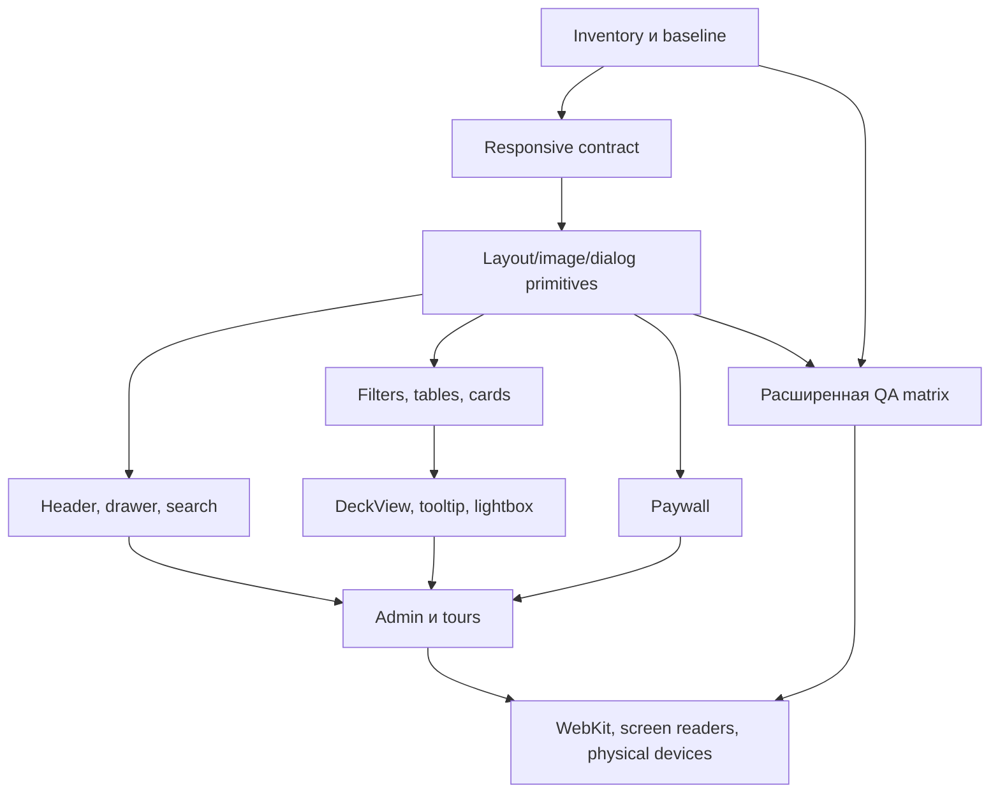

<!-- markdownlint-disable MD013 MD060 -->

# Дорожная карта качества мобильной версии Manacost Stats

Дата аудита: 20 июля 2026 года
Горизонт: 10 недель для P0/P1, затем постоянная visual regression матрица
Минимальная поддерживаемая ширина: 320 CSS px

## Статус реализации на 21 июля 2026 года

- Создан единый inventory из 33 P0 fixtures для профилей 320×568, 390×844 и 768×1024.
- Ежедневная all-P0 visual QA матрица снимает 99 детерминированных screenshots и сохраняет manifest с SHA-256.
- Реальный HTTP 404, overflow diagnostics, runtime errors, axe и touch-target audit входят в один проверяемый сценарий.
- Общий header закреплён высотой 49 px; поиск и FAQ имеют touch area не меньше 44×44 px.
- Восемь ссылок footer имеют touch area не меньше 44×44 px и двухколоночный compact layout без page overflow.
- Число известных touch-target нарушений во всей P0-матрице снижено с 1408 до 478. Ratchet `143 / 143 / 192` по трём профилям блокирует повторный рост.

## 1. Цель

Мобильная версия должна быть самостоятельным удобным интерфейсом, а не уменьшенной копией desktop. Пользователь должен без горизонтального скролла страницы найти карту, применить фильтры, прочитать статистику, открыть DeckView/lightbox, понять paywall, работать с профилем и выполнить основные admin-задачи.

## 2. Приоритеты

- **P0** — обрезанный или недоступный контент, page overflow, блокирующая навигация, сломанный touch/keyboard flow, недоступный paywall или admin save.
- **P1** — качество взаимодействия, единый responsive contract, производительность и кроссбраузерность.
- **P2** — дополнительные mobile-first улучшения после закрытия критических сценариев.

## 3. Результаты аудита текущей реализации

### Сильные стороны

- Mobile drawer со scroll lock, Escape/focus behavior и крупными touch targets уже реализован в `src/App.tsx`/`src/index.css`.
- Верхний utility header/search/help имеет mobile layout.
- Standard Cards уже умеет:
  - сворачивать расширенные фильтры;
  - показывать gallery в две колонки;
  - преобразовывать table в карточки на узком экране;
  - переводить detail hero/pools/decks в одну колонку;
  - открывать полноэкранный lightbox.
- `scripts/e2e-qa.mjs` проверяет desktop 1440×900 и mobile 390×844, horizontal overflow, axe, 200% zoom/reflow, reduced motion и forced colors.
- Tour engine уже учитывает mobile bottom sheet и видимость target.
- Admin translation tables местами превращаются в карточки при ширине около 760 px.

### Главные разрывы

| Разрыв | Текущее проявление | Риск | P |
|---|---|---|---|
| Слишком много несогласованных breakpoints | В CSS встречаются 639/640/700/720/760/767/900/980/1023/1024/1050/1120/1160/1240 | Локальная правка ломает соседний маршрут | P0 |
| Нет системной проверки 320/360/412/768/landscape | Основной mobile E2E — 390×844 | Обрезка остаётся незамеченной | P0 |
| Hover tooltip исчезает на mobile, но не всегда есть равноценный быстрый preview | `CardPreviewTooltip` отключается на узком экране | Touch-пользователь теряет информацию | P0 |
| Таблицы используют разные стратегии | Standard Meta сохраняет wide table с horizontal scroll, Cards превращает строки в cards | Непредсказуемость и скрытые колонки | P0 |
| DeckView зависит от vendor renderer и сложного модального layout | `HsReplayDeckList`, vendor deckview CSS | Белые полосы, обрезка, длинные имена, трудный touch preview | P0 |
| Paywall содержит большие фиксированные `minHeight` и inline styles | `PaywallGate` и route overrides | Пустоты, обрезка CTA, конфликт с клавиатурой | P0 |
| Overlays не унифицированы | Search, lightbox, deck modal, tooltip, tour | Разные focus/scroll/safe-area ошибки | P0 |
| CSS-монолиты и `!important` | `route-parchment.css`, `battlegrounds-parchment.css`, `DeferredRoutes.css`, `contests.css` | Каскад хрупок, visual regressions | P1 |
| Нет регулярного WebKit/Firefox mobile CI | Текущий browser QA в основном Chromium/Puppeteer | Safari/iOS проблемы обнаруживаются вручную | P1 |

Крупнейшие зоны CSS по аудиту:

- `src/route-parchment.css` — около 58 КБ и сотни `!important`;
- `src/battlegrounds-parchment.css` — около 43 КБ;
- `src/features/DeferredRoutes.css` — около 65 КБ;
- `src/features/contests.css` — около 93 КБ;
- vendor deckview styles — около 40 КБ.

## 4. Responsive contract

### 4.1. Базовые диапазоны

| Имя | Диапазон | Назначение |
|---|---|---|
| Compact | 0–639 px | Телефоны portrait/landscape, одна основная колонка |
| Medium | 640–1023 px | Планшеты и большие landscape телефоны |
| Desktop | 1024–1279 px | Sidebar + основной desktop layout |
| Wide | ≥1280 px | Более плотные таблицы/галереи без увеличения длины строки текста |

CSS custom properties нельзя использовать непосредственно внутри обычного `@media`, поэтому контракт должен быть закреплён документацией, shared utility classes/containers, JS `matchMedia` helper и stylelint rule. Route-specific breakpoint допустим только с комментарием причины и отдельным screenshot test.

### 4.2. Layout tokens

| Token | Compact | Medium | Desktop/Wide |
|---|---:|---:|---:|
| Page gutter | 12–16 px | 20–24 px | 24–32 px |
| Section gap | 20–24 px | 24–32 px | 32–40 px |
| Card gap | 8–12 px | 12–16 px | 16–20 px |
| Primary touch target | ≥48×48 px | ≥44×44 px | ≥40×40 px, но keyboard focus обязателен |
| Body line length | 45–75 символов | 50–80 | 55–85 |
| Modal gutter | 8–12 px + safe area | 16–24 px | 32 px |

Все full-screen поверхности используют `100dvh`, `env(safe-area-inset-*)` и `visualViewport` для экранной клавиатуры. `100vh` не должен быть единственным ограничителем высоты.

## 5. Целевое поведение ключевых компонентов

### Навигация и новый header

- На compact остаётся один компактный sticky top bar.
- Кнопки меню, поиска, помощи и профиля не перекрывают друг друга при 320 px.
- Search открывается как прямоугольная mobile sheet/full-screen dialog без странной овальной focus-формы.
- Drawer имеет один scroll container, safe-area padding, focus trap, Escape/back и возврат focus.
- Deep search показывает секции «Статьи», «Карты», «FAQ», loading/empty/error и учитывает entitlement без раскрытия закрытого snippet.
- При открытой экранной клавиатуре поле и активный результат остаются видимыми.

### Фильтры

- На compact над контентом остаются поиск, сортировка и кнопка «Фильтры (N)».
- Остальные controls открываются в bottom/full-height sheet.
- В sheet есть sticky header, scroll body и sticky footer «Показать N»/«Сбросить».
- Выбранные значения отображаются chips под toolbar; chip удаляется одним tap.
- Native select допустим как fallback, но списки классов/дополнений не должны выходить за viewport.
- Locked filters явно показывают замок и объяснение тарифа; focus не попадает в неактивный control.

### Таблицы

Для каждой таблицы выбрать один из двух контрактов:

1. **Card reflow** — предпочтительно для Cards, Matchups, профиля и admin forms.
2. **Scrollable data grid** — только когда сравнение колонок важнее; есть sticky первая колонка, видимая подсказка scroll и кнопка смены вида.

На mobile default должен быть card/grid view. Нельзя молча скрывать статистическую колонку. Сортировка объявляет активное поле и направление для screen reader.

### Галереи и плитки карт

- Compact: две карточки в ряд при 360–412 px; для 320 px допустимы две только если ширина не ломает название и touch target, иначе одна.
- Medium: 3–4; desktop: целевая плотность конкретного раздела, например 6 в Arena tier list.
- Изображение использует стабильный `aspect-ratio`, `object-fit: contain`, прозрачный фон без белой полосы.
- Редкость задаёт glow/border на hover и focus-visible; touch не зависит от hover.
- Название не обрезается без доступного полного имени (`title` недостаточно; нужен текст/accessible label/detail action).
- Skeleton резервирует точный размер финального изображения.

### Tooltip и touch preview

- Desktop: portal tooltip по hover и keyboard focus, позиционируется относительно viewport и flip/shift, никогда не режется `overflow` родителя.
- Mobile: tap по preview action открывает bottom sheet с полной картой; повторный tap/кнопка открывает detail page.
- Tooltip не содержит уникальную информацию, которой нет на detail page.
- Escape/close/outside click возвращает focus инициатору.
- Pointer coarse отключает hover-анимации, но не убирает информацию.

### Lightbox

- Общий dialog primitive для card art, deck image и article media.
- Focus trap, close button ≥48 px, Escape/back, body scroll lock и focus restoration.
- Fit-to-screen по умолчанию; zoom/pan только после явного действия и без ловушки жестов.
- Изображение не выходит под notch/home indicator; rotation пересчитывает размеры.
- Ошибка изображения показывает название, retry и ссылку на исходную сущность.

### DeckView

- Desktop composition остаётся двухколоночным только при достаточной ширине контейнера; compact — одна колонка.
- Строки deck compact, но имеют ≥44 px активной высоты и не оставляют «хвост» незаполненной background image.
- Art заполняет только центральную область строки; mana/quantity/legendary имеют отдельные стабильные области.
- Длинное русское имя использует безопасное сокращение с доступным полным названием.
- Focus/tap по строке открывает полный card preview; hover остаётся дополнением.
- 30/40-card decks, duplicate cards, signature/golden variants и missing image имеют fixtures.
- Модалка deck не должна быть выше viewport без собственного scroll body; код/копирование остаются доступны в sticky footer.
- Ошибка vendor renderer изолирована widget boundary и заменяется текстовым составом, а не «Внутренняя ошибка сервера» внутри пустой плитки.

### Paywall

- Blur применяется только к закрытой статистике, а не к навигации, заголовку и публичному описанию.
- Убрать фиксированные `minHeight` 660–760 px; высота следует контенту.
- На compact CTA — обычный flow/bottom card, не абсолютный overlay поверх данных.
- Закрытый DOM не читается screen reader и не получает focus до entitlement.
- Состояния anonymous, insufficient plan, expired temporary access, active Diamond и admin тестируются отдельно.
- CTA сообщает конкретно, что откроется, и не вызывает layout shift после auth refresh.

### Статьи

- Cover показывается полностью по принятому aspect ratio без случайного crop; `object-position` можно задавать из CMS/admin.
- Карточки 1/2/3 колонки по compact/medium/desktop.
- Заголовок, tag, access badge, дата и action не налезают на изображение.
- Article body использует комфортную длину строки, responsive tables/media и якорные заголовки.
- Вставленные внешние изображения получают размеры, lazy loading ниже fold, fallback и lightbox.

### Admin

- На compact admin navigation становится drawer/section switcher.
- Data tables превращаются в карточки или scroll grid по явному контракту.
- Save/batch actions закреплены снизу и учитывают safe-area/keyboard.
- Переводы механик/тегов показывают английский ключ, пример карты и русское поле в одной логической карточке.
- Parser control отображает global mode, per-section toggles, pending/running/error, последнее успешное обновление и audit history.
- Опасные действия требуют подтверждения с полным названием раздела; double tap не создаёт два job.
- Desktop остаётся основным интерфейсом для массовых операций, но ни одна критическая операция не должна быть недоступна с телефона.

### Tours/help

- Mobile step — bottom sheet, target подсвечивается через portal без обрезки.
- Перед показом шага раскрывается drawer/filter section, если target скрыт.
- Стрелка не указывает за viewport; при невозможности позиционирования используется текст «элемент подсвечен выше».
- Кнопки «Назад», «Далее», «Пропустить» ≥44 px; прогресс озвучивается как «шаг 1 из 5».

## 6. Матрица маршрутов

| Группа | Маршруты | Основной mobile риск | Обязательная проверка |
|---|---|---|---|
| Shell | Все | Header/drawer/search overlap | 320 px, keyboard, scroll lock, focus return |
| Home | `/` | Hero/cards/async sections | Slow network, skeleton, error boundary |
| Articles/FAQ | `/articles`, `/faq` | Cover crop, длинный текст, accordion | 200% zoom, long Russian copy, external image error |
| Profile/auth | login/profile state | Forms и клавиатура | Autofill, validation, expired session, no overlay trap |
| Standard Cards | `/standard/cards`, detail | Filters, grid/table, tooltip, pools/decks | 320/390/768, 0/1/many results, locked stats |
| Standard analytics | `/standard/meta`, `/standard/matchups`, `/standard/vicious-gold` | Wide tables/charts/paywall | Card view default, scroll alternative, Diamond/anonymous |
| Arena | `/classes`, `/tierlist`, `/legendaries` | 6-column desktop gallery scale и tooltip clipping | 2-column compact, rarity focus, full preview |
| BG Heroes | `/heroes`, detail | Hover crop и large art | Pointer coarse, landscape, long name |
| BG Library | `/library`, detail/archive | Filters, related pools, stats | Empty pool, show-more, lightbox |
| BG tools | tier/strategy/builder routes | Drag/drop and dense controls | Touch reorder alternative, no precision-only action |
| Admin | `/admin` и sections | Dense forms/tables/jobs | 320/768, keyboard, save, confirm, stale state |
| Contests/gallery | `/contests`, `/gallery` при наличии | Media size/forms | Upload/preview, permissions, slow image |

## 7. Дорожная карта

### Фаза 0 — измеримый baseline, неделя 1

| ID | P | Задача | Зависимости | Приёмка |
|---|---|---|---|---|
| MOB-001 | P0 | Создать inventory responsive components/routes | Нет | Для каждой строки route matrix указан owner и screenshot fixture |
| MOB-002 | P0 | Автоматически измерить overflow | MOB-001 | CI логирует первый overflowing element, bounding box и route, а не только общий fail |
| MOB-003 | P0 | Снять screenshots всех P0 routes на 320/390/768 | Test accounts/fixtures | Baseline утверждён; известные дефекты заведены с priority |
| MOB-004 | P1 | Измерить mobile RUM | Consent/telemetry | LCP/INP/CLS, JS errors и route доступны по viewport/release |
| MOB-005 | P1 | Провести 5 task-based ручных сессий | Тестовые аккаунты | Время/ошибки: найти карту, применить фильтр, открыть deck, понять paywall, изменить parser control |

### Фаза 1 — responsive foundation, недели 1–3

| ID | P | Задача | Возможные файлы | Приёмка и тест |
|---|---|---|---|---|
| MOB-101 | P0 | Утвердить 639/1023/1279 contract | Shared styles + JS media helper | Новый случайный breakpoint блокируется lint rule; исключение документировано |
| MOB-102 | P0 | Ввести shared page/container/grid/stack primitives | `src/index.css`, shared UI styles | 320 px без page overflow; gutters/safe area едины |
| MOB-103 | P0 | Ввести общий dialog/sheet primitive | shared UI | Search, filters, lightbox, deck modal и tour используют единый focus/scroll contract |
| MOB-104 | P0 | Ввести общий responsive image primitive | shared UI | Aspect ratio, loading, decoding, fallback и no-white-strip поведение покрыты тестом |
| MOB-105 | P1 | Добавить CSS layers и ownership | route CSS | Новые `!important` запрещены без allowlist; baseline ratchet уменьшается |
| MOB-106 | P1 | Нормализовать typography/controls | design tokens | Ни один input не вызывает iOS auto zoom; controls ≥44/48 px; текст читаем при 200% |

Контрольная точка: shared primitives проверены изолированно на 320/390/768, keyboard и reduced motion до массового переноса маршрутов.

### Фаза 2 — shell, навигация, поиск, профиль, недели 2–4

| ID | P | Задача | Приёмка и тест |
|---|---|---|---|
| MOB-201 | P0 | Упростить compact header | Все действия доступны на 320 px без overlap; tap targets ≥48 px |
| MOB-202 | P0 | Перенести drawer/search на shared sheet/dialog | Scroll lock, keyboard viewport, Escape/back, focus restoration проходят E2E |
| MOB-203 | P0 | Доработать deep search states | Результаты сгруппированы, entitlement не течёт, long query/empty/error/slow states |
| MOB-204 | P0 | Привести profile/auth forms к mobile flow | Autofill, password manager, inline errors и submit видны с клавиатурой |
| MOB-205 | P1 | Добавить skip links/landmarks и active nav announce | Axe + screen reader smoke без дублирующей навигации |

### Фаза 3 — cards, filters, tables и galleries, недели 3–6

| ID | P | Задача | Приёмка и тест |
|---|---|---|---|
| MOB-301 | P0 | Перевести все сложные filters на mobile sheet contract | Selected chips, result count, reset/apply, locked filters, browser back |
| MOB-302 | P0 | Определить card reflow для каждой data table | Ни одна колонка молча не исчезает; active sort виден и озвучивается |
| MOB-303 | P0 | Исправить gallery/card image boxes | Нет обрезки/белых полос; common/golden/diamond/signature/missing fixtures |
| MOB-304 | P0 | Добавить touch preview вместо hover-only | Полная карта доступна tap/keyboard; desktop tooltip не режется viewport |
| MOB-305 | P0 | Уплотнить mobile grid разумно | На 320/360 названия и действия не перекрываются; row gaps консистентны |
| MOB-306 | P1 | Виртуализировать/порционно рендерить большие списки при измеренной необходимости | Scroll position стабилен, screen reader/pagination fallback есть, INP не ухудшается |

Representative fixtures: 0 результатов, 1 карта, 60 карт, long Russian name, отсутствующая статистика, 100% как invalid sample, multiple classes, 45 дополнений.

### Фаза 4 — DeckView, overlays, pools и paywall, недели 4–7

| ID | P | Задача | Приёмка и тест |
|---|---|---|---|
| MOB-401 | P0 | Отделить DeckView data model от vendor renderer | При падении renderer доступен текстовый состав и copy code |
| MOB-402 | P0 | Перерисовать compact deck rows | Нет белых полос/незаполненного art; 30/40 карт; long names; 1×/2×/legendary |
| MOB-403 | P0 | Добавить card preview для deck row | Hover/focus desktop и tap mobile показывают полную карту без clipping |
| MOB-404 | P0 | Перевести deck/card/article lightbox на общий dialog | Rotation, pinch/zoom policy, focus, safe-area и error image проходят |
| MOB-405 | P0 | Исправить generation pools/related cards | Первая строка + «Показать все», перенос по ширине, пустые связи отфильтрованы |
| MOB-406 | P0 | Перестроить paywall без фиксированной высоты | CTA в flow, только statistics blurred, screen reader/focus contract корректен |
| MOB-407 | P1 | Добавить visual snapshots variants | Standard/Wild, article/deck/card, gold/diamond/signature, stale/error |

### Фаза 5 — Arena/BG/Admin и tours, недели 6–8

| ID | P | Задача | Приёмка и тест |
|---|---|---|---|
| MOB-501 | P0 | Пройти весь Arena/BG route matrix shared primitives | Ни одной page-level horizontal scroll или clipped hover/focus state |
| MOB-502 | P0 | Дать touch alternative drag/drop в BG builder | Клавиатура/tap reorder доступны; drag не единственный способ |
| MOB-503 | P0 | Перевести admin sections на cards/grid contract | Parser, articles, users, translations и contests имеют usable 320/768 flow |
| MOB-504 | P0 | Сделать admin actions idempotent | Double tap не создаёт два job; pending/complete/error видны |
| MOB-505 | P0 | Проверить page tours на всех key pages | Target auto-reveal, progress, skip, scroll correction, no clipped arrow |
| MOB-506 | P1 | Добавить mobile help context | Help открывается рядом с задачей, не закрывает target и запоминает completion per version |

### Фаза 6 — cross-browser, accessibility и performance, недели 7–10

| ID | P | Задача | Приёмка и тест |
|---|---|---|---|
| MOB-601 | P0 | Расширить существующий Puppeteer QA matrix | 320/360/390/412/768 + landscape; overflow, screenshot, axe и journeys |
| MOB-602 | P1 | Принять ADR на Playwright для WebKit/Firefox | Representative P0 journeys зелёные в Chromium/WebKit/Firefox |
| MOB-603 | P0 | Провести VoiceOver/TalkBack smoke | Навигация, фильтры, table/card view, dialog, DeckView, paywall и admin save |
| MOB-604 | P0 | Проверить 200% zoom/reflow и font scaling | Нет потери контента/действий; текст не обрезается фиксированной высотой |
| MOB-605 | P1 | Ввести mobile performance budgets | CI не допускает regression route JS/CSS/image; RUM CWV по p75 |
| MOB-606 | P1 | Провести physical-device matrix | Минимум один актуальный iPhone Safari и Android Chrome low/mid device |

## 8. Visual regression matrix

### Viewports

| Профиль | Размер | Зачем |
|---|---:|---|
| Compact minimum | 320×568 | Самая узкая поддерживаемая ширина |
| Android common | 360×800 | Малый Android |
| iPhone common | 390×844 | Сохраняет текущий baseline |
| Large phone | 412×915 | Проверка плотности и длинных списков |
| Phone landscape | 844×390 | Высота, overlays, deck/lightbox |
| Tablet portrait | 768×1024 | Medium contract |
| Tablet landscape | 1024×768 | Переход к desktop sidebar |
| Desktop reference | 1440×900 | Проверка, что mobile fixes не ломают desktop |

### Обязательные оси

- Chromium во всех размерах; WebKit/Firefox на representative routes.
- DPR 1 и 2; browser zoom 100% и 200%.
- Pointer fine/hover и pointer coarse/no-hover.
- Light/dark системная настройка, если интерфейс её учитывает; forced colors.
- Normal/reduced motion.
- Русские длинные строки и английский fallback.
- anonymous, Diamond, temporary full access, expired access, admin.
- loading, success, empty, partial/stale, validation warning, 404, 500, offline.
- common, rare, epic, legendary, golden, diamond, signature и missing card asset.

### Screenshot policy

- Шрифты, время, random data и animations фиксируются.
- Разрешённый diff сначала объясняется owner, затем baseline обновляется.
- P0 regions: header/drawer, filters, first content row, paywall CTA, modal footer, admin save.
- Screenshot diff дополняется DOM assertions: картинка может выглядеть похожей, но быть недоступной focus/touch.

## 9. Accessibility contract

- Цель — WCAG 2.2 AA для ключевых journeys.
- Touch targets ≥44×44 px, основные mobile actions ≥48×48 px.
- `:focus-visible` заметен и не заменяется только редкостным glow.
- DOM/tab order совпадает с визуальным порядком после reflow.
- Dialog/sheet имеет name, modal semantics, focus trap и restoration.
- Ошибка/обновление/результат фильтра объявляются через корректный live region без спама.
- Цвет не является единственным носителем редкости, ошибки или locked state.
- Закрытый/blurred контент не читается assistive technology.
- Hover-only функция имеет tap и keyboard equivalent.
- Reduced motion отключает масштабирование/параллакс, но сохраняет state feedback.
- Контент остаётся доступен при 200% zoom и увеличенном системном шрифте.

## 10. Performance budgets

Текущий initial bundle baseline, отмеченный в стабилизационном аудите, примерно 263 КБ raw / 80 КБ gzip. Сначала вводится ratchet «не ухудшать», затем route budgets.

| Метрика | Цель |
|---|---|
| LCP p75 mobile | ≤ 2,5 s |
| INP p75 mobile | ≤ 200 ms |
| CLS p75 mobile | ≤ 0,1 |
| Initial JS | Не выше зафиксированного baseline; P1 — снижение ≥15% без переноса в синхронный CSS/HTML |
| Route chunk | Budget по маршруту; admin/deckview не загружается на home/articles/cards list без необходимости |
| LCP image | Responsive format/size; provisional transfer budget ≤250 КБ на 4G fixture |
| Card thumbnail | Размер соответствует rendered width; lazy ниже fold, без загрузки full art для каждой плитки |
| Interaction long task | Нет >200 ms в common filter/sort/open-dialog journey на mid Android fixture |

CWV оценивается по field p75, отдельно mobile/desktop и route template. Lighthouse/CPU throttle используется как диагностический gate.

Оптимизации:

- лениво загружать DeckView, admin editors, charts и lightbox renderer;
- не загружать golden/full art до запроса пользователя;
- использовать `srcset`/`sizes`, modern formats и точные dimensions;
- отменять устаревший filter/search request;
- debounce не должен задерживать первый keyboard/tap feedback;
- virtualize только после профилирования и с доступным fallback;
- prefetch detail только при reasonable connection/data saver policy.

## 11. Автоматические тесты

### На каждый PR

- Typecheck/build и существующий `verify:ci`.
- Overflow detector на 320/390/768 для затронутых routes.
- Axe на representative state.
- Screenshot components и минимум один route screenshot.
- Keyboard flow для dialog/filter sheet/lightbox.
- Touch target geometry assertions для primary actions.
- Test fixture с long Russian strings и broken image.

### Nightly

- Полная route × viewport screenshot matrix.
- Anonymous/Diamond/admin journeys.
- Slow 4G + CPU throttle performance run.
- Loading/empty/error/stale/offline states.
- Landscape rotation и soft keyboard flow.
- Golden/diamond/signature asset variants.

### Перед крупным релизом

- WebKit и Firefox representative suite.
- VoiceOver/TalkBack smoke.
- Физические iPhone/Android.
- Реальная подписка/paywall/auth refresh.
- 30/40-card DeckView и большие filter datasets.

## 12. KPI

Baseline фиксируется в фазе 0; ниже целевые quality gates.

| KPI | Цель |
|---|---|
| Page-level horizontal overflow на 320–1023 px | 0 на всех поддерживаемых routes |
| Clipped tooltip/dialog/lightbox | 0 в automated matrix |
| Primary actions с target <44×44 px | 0 |
| Ключевые journeys, доступные без hover | 100% |
| P0 routes с 320/390/768 screenshots | 100% |
| P0 journeys в Chromium/WebKit/Firefox | 100% после MOB-602 |
| Axe critical/serious violations | 0 |
| Crash-free mobile sessions | ≥99,8% |
| CWV p75 mobile | LCP ≤2,5s, INP ≤200ms, CLS ≤0,1 |
| Visual regression escaped to production | Снижение ≥80% от baseline за 90 дней |
| Task success: карта/фильтр/deck/paywall/admin control | ≥95% внутренних acceptance runs |
| Mobile support tickets по обрезке/скроллу | Снижение ≥75% от baseline за 90 дней |

## 13. Порядок и зависимости

Нельзя начинать массовую правку route CSS до появления shared primitives и screenshot baseline. Иначе визуальные изменения будет невозможно отличить от новых регрессий.

## 14. Definition of Done

- Все ключевые страницы работают от 320 px без page-level overflow и обрезки.
- Breakpoint contract един; исключения редки, документированы и протестированы.
- Navigation/search/filter/lightbox/deck/tour используют общие доступные dialog/sheet primitives.
- Tooltip имеет keyboard и touch equivalent; mobile не зависит от hover.
- Карточки и deck rows не имеют белых полос, неверного crop и нестабильной высоты.
- Таблицы имеют заранее выбранный card reflow или управляемый scroll grid.
- Paywall не использует фиксированную большую высоту и блокирует только статистику.
- Admin critical operations доступны на compact/medium и защищены от double submit.
- CI покрывает viewport, access, state и asset matrix; nightly включает performance.
- WebKit, VoiceOver/TalkBack и физические устройства проверяются по расписанию.
- Mobile CWV и crash-free sessions измеряются в production и соответствуют KPI.
