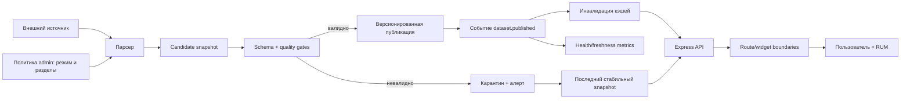
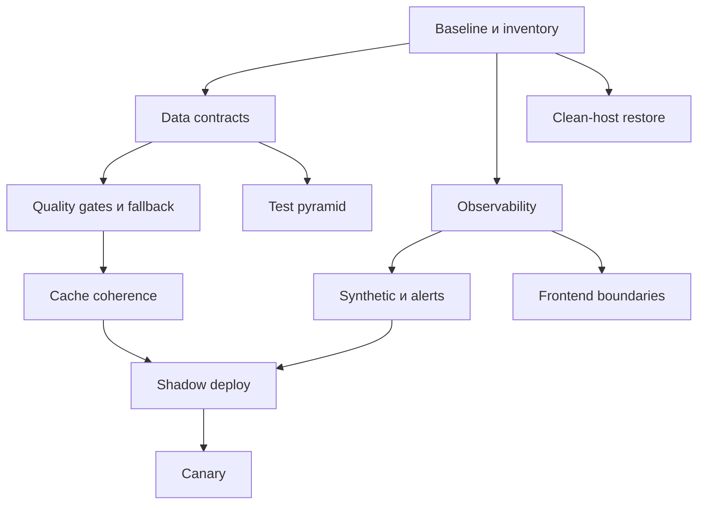

<!-- markdownlint-disable MD013 MD060 -->

# Дорожная карта стабильности Manacost Stats

Дата аудита: 20 июля 2026 года
Обновлено: 21 июля 2026 года
Горизонт: 90 дней для P0/P1, затем квартальный цикл
Область: frontend, Express API, данные парсеров, кэши, деплой и эксплуатация

## 1. Назначение документа

Цель программы — сделать ошибки редкими, локализованными, заметными до пользователя и безопасно обратимыми. Документ расширяет существующий `STABILIZATION.md`: уже выполненные меры не предлагается переписывать, их нужно довести до измеримых SLO и закрыть оставшиеся пробелы.

План также учитывает новый глобальный режим парсеров «ранняя/стабильная мета» и возможность включать обновление отдельных разделов. Эта панель должна управлять общей политикой публикации, а не создавать отдельную параллельную систему состояния.

## 2. Приоритеты

- **P0** — риск недоступности, публикации неверных данных, утечки доступа, невозможности отката или потери данных.
- **P1** — системное снижение числа инцидентов и времени восстановления.
- **P2** — дальнейшее повышение зрелости после достижения базовых SLO.

## 3. Текущая база

### Уже реализовано

- Immutable releases, `current/previous`, readiness gate и автоматический rollback в `scripts/deploy-release.sh`.
- Smoke-проверки сервера и recovery в `scripts/server-build-smoke.mjs` и `scripts/recovery-runtime-smoke.mjs`.
- Health endpoints `/api/health/live`, `/api/health/ready`, `/api/health/data` в `server/health.ts` и `server/healthRoutes.ts`.
- Структурированные request logs, request ID и базовые Prometheus metrics в `server/observability.ts` и `server/metrics.ts`.
- Изолированный scraper service/timer, атомарная публикация snapshot и проверки критических Arena-данных.
- Зашифрованные backup/restore/verify/replication scripts.
- Большой набор API/security/route тестов и `scripts/e2e-qa.mjs`.
- CI `verify:ci` с lint/typecheck, архитектурными проверками, тестами, build, smoke и budgets.
- Разделение части `server/index.ts` на специализированные routers.
- Shell-wide recovery boundary с разделением render/chunk failure, incident ID и безопасным retry/reload flow.
- Локальная recovery boundary для Standard Meta и отказоустойчивый DeckView с текстовым составом.

### Основные риски

| Риск | Фактическое проявление | Последствие | P |
|---|---|---|---|
| Route/widget boundaries покрывают не все разделы | Shell, Home и Standard Meta защищены; другие lazy features ещё мигрируют | Ошибка незакрытого виджета может заменить весь маршрут shell fallback | P0 |
| Контракты данных нормализуются вручную | Много независимых преобразований в `server/index.ts` и routers, без общего runtime schema слоя | Невозможные проценты, пустые related cards, drift полей | P0 |
| Data health покрывает только часть наборов | Readiness в основном ориентирован на winrates/tierlist/legendaries | Standard Cards/BG/Meta могут быть сломаны при зелёном health | P0 |
| Кэши распределены по множеству `Map`/TTL | `server/index.ts` и отдельные routers | После публикации разные страницы видят разные версии | P0 |
| Метрики процесса хранятся в памяти | `server/metrics.ts` | История теряется при restart; сложно расследовать регрессию | P0 |
| Нет browser error tracking/RUM | Frontend | JS-ошибки пользователя не видны серверному мониторингу | P0 |
| External synthetic workflow не установлен как production control | Есть пример workflow и `scripts/production-monitor.mjs` | Сбой снаружи может остаться незамеченным | P0 |
| Synthetic coverage узкий | Проверяются лишь несколько HTML-маршрутов и три dataset | Ошибка paywall/detail/admin остаётся незаметной | P0 |
| Монолиты осложняют безопасные изменения | `server/index.ts` ~8,6 тыс. строк, `src/features/DeferredRoutes.tsx` ~6,4 тыс. строк, `src/App.tsx` ~1,8 тыс. строк | Высокий regression radius | P1 |
| Тесты в основном кастомные `tsx` scripts | Нет единой component/coverage инфраструктуры | Неизвестное покрытие UI и ветвей ошибок | P1 |
| CSS cascade хрупок | Более тысячи `!important` по текущему аудиту | Визуальные регрессии после локальной правки | P1 |
| Полный host-loss drill не завершён | Отмечено в `STABILIZATION.md` | Backup может оказаться непригодным в реальном инциденте | P0 |

## 4. Неприкосновенные инварианты

1. Невалидный snapshot никогда не заменяет последнюю пригодную стабильную версию.
2. Ранняя мета всегда явно помечена и не может молча стать стабильной.
3. Одна страница не смешивает версии одного dataset.
4. Переключение режима или parser scope имеет автора, причину, время, TTL и audit log.
5. Отказ внешнего API не удаляет уже опубликованные данные.
6. Анонимный ответ не содержит данных или cache key подписчика/администратора.
7. Любой релиз можно откатить вместе с совместимой версией data schema.
8. Health зелёный только тогда, когда критические пользовательские сценарии действительно обслуживаются.
9. Ошибка отдельного виджета не должна уронить навигацию или весь маршрут.
10. Для каждого алерта есть владелец, порог, runbook и критерий закрытия.

## 5. Целевой путь данных



Admin control не публикует данные напрямую. Он меняет durable policy, а parser worker всё равно проходит candidate, validation, atomic publish и cache invalidation.

## 6. Единый контракт dataset

Каждый статистический ответ должен иметь общий envelope:

```text
schemaVersion
dataset
datasetVersion
mode: stable | early
generatedAt
sourceUpdatedAt
publishedAt
freshness: fresh | aging | stale | unavailable
partial: boolean
quality: { status, warnings, sampleSize, coverage }
data
```

Ключевые проверки до публикации:

| Gate | Пример правила | Действие при провале |
|---|---|---|
| Schema | Обязательные поля, типы, enum и версия | Карантин, прежний snapshot остаётся live |
| Диапазоны | Проценты 0–100, игры ≥ 0, mana/attack/health в допустимом диапазоне | Reject |
| Делители | Нельзя считать winrate при нулевом denominator | `null`, а не 0/100; warning |
| Минимальная выборка | Статистика публикуется только выше порога для конкретной метрики | Скрыть метрику или пометить insufficient sample |
| Уникальность | Нет дублирующих card/deck/entity IDs | Reject либо детерминированная дедупликация с warning |
| Referential integrity | Related card/deck ссылается на существующую сущность/изображение | Отфильтровать битую связь; quality warning |
| Полнота | Количество записей и заполненность ключевых полей не падают за пределы режима | Reject stable; early допускает отдельный документированный порог |
| Непрерывность | Резкий скачок ±X% сравнивается с предыдущим snapshot | Manual review/hold, не автоматическое принятие |
| Freshness | `sourceUpdatedAt` соответствует расписанию parser | Не публиковать как fresh; сохранить fallback |
| Cross-source plausibility | Частота карт/классов/колод согласуется с общей выборкой | Hold или warning по строгости правила |

Порог `X`, минимальная выборка и допустимая полнота задаются отдельно для каждого dataset и хранятся версионированно. Нельзя использовать один произвольный порог для Standard, Arena и Battlegrounds.

## 7. Дорожная карта

### Фаза 0 — baseline и ownership, неделя 1

| ID | P | Работа | Зависимости | Критерий приёмки |
|---|---|---|---|---|
| STAB-001 | P0 | Составить каталог сервисов, routers, datasets, cron/systemd и state stores | Нет | У каждого элемента есть owner, критичность, источник, потребитель и runbook link |
| STAB-002 | P0 | Зафиксировать 28-дневный baseline ошибок/latency/freshness/deploys | Доступ к production metrics/logs | Dashboard не содержит выдуманных baseline; видны пробелы телеметрии |
| STAB-003 | P0 | Классифицировать данные P0/P1/P2 | STAB-001 | `/api/health/data` и алерты используют утверждённую критичность |
| STAB-004 | P0 | Назначить incident commander/on-call и канал | Команда | Есть рабочий escalation path и шаблон инцидента |

Контрольная точка: до изменения порогов команда знает, какие datasets должны блокировать readiness и какой пользовательский сценарий они защищают.

### Состояние frontend recovery на 21 июля 2026 года

| ID | Статус | Реализовано | Что осталось |
|---|---|---|---|
| STAB-101 | Выполнено | `AppErrorBoundary` защищает shell; render retry выполняется без reload, chunk failure предлагает явное обновление; browser QA и unit contract зелёные | Подключить внешний browser error collector в STAB-105 |
| STAB-102 | В работе | `RecoverableSurfaceBoundary` локализует ошибки маршрута Standard Meta и оставляет sidebar/header/footer доступными | Последовательно обернуть остальные критические lazy routes по inventory, не увеличивая eager bundle |
| STAB-103 | В работе | Общий `HsReplayDeckList` изолирует ошибки DeckView в Standard Meta и Vicious Gold; при отказе остаются русский текстовый состав, код колоды и Retry | Перевести `StandardCards` на тот же loader; затем графики, tooltip/lightbox и рекомендации |
| STAB-104 | В работе | Введены единые `loading`, `empty`, `error`, `stale` surfaces; Standard Meta мигрирована, кнопки не меньше 44 px, состояния имеют корректные live roles | Подключать `stale` только из versioned freshness envelope STAB-201, затем мигрировать остальные страницы |

Проверенное доказательство текущего среза: production build и budgets зелёные; DeckView JS выделен в lazy chunk 30,43 КБ; initial JS 253 904/254 000 Б; детерминированный browser QA проверяет API 503→200 без reload и падение `renderDeck` на 320 px без потери shell, кода колоды или горизонтального containment.

### Состояние runtime-контрактов на 21 июля 2026 года

| ID | Статус | Реализовано | Что осталось |
|---|---|---|---|
| STAB-201 | В работе | Standard Meta получила envelope v1, deterministic `datasetVersion`, vendor content negotiation, server outbound validation и client boundary validation с N/N-1 legacy fallback | Перенести контракт на остальные критические Standard/Arena/BG datasets и определить migration window |
| STAB-202 | В работе | Для Standard Meta проверяются enum/ranges, уникальность, даты, полнота stable, массовые 97–100%, minimum rows и сокращение stable более чем на 50% | Добавить cross-source gates и покрыть Standard Cards, Arena и BG |
| STAB-204 | В работе | Standard Meta переносит публикационный `early/stable` mode из конкретного upstream candidate; UI явно показывает early/partial | API данных должен закрепить publication channel как обязательное поле всех published snapshots |
| STAB-205 | Выполнено | Full-admin панель хранит mode/scope с revision, reason и TTL; все ответы private/no-store; добавлены локальный audit log, реальное состояние systemd и mobile/reflow UI | Эксплуатационно проверить новый exporter после следующего разрешённого production deploy |
| STAB-206 | В работе | Невалидный Standard Meta candidate не заменяет последнюю проверенную in-process версию; fallback получает реальный freshness | Добавить durable last-known-good после restart и ограниченный stale policy |
| STAB-307 | В работе | Ручные terminal runs после restart обнаруживаются durable reconciler, coalesce одну глобальную очистку, повторяют временный сбой с backoff и карантинят повреждённый ledger | Перейти от polling к общему событию `dataset.published` для всех автоматических и ручных публикаций |

Совместимость Standard Meta: новый клиент запрашивает `application/vnd.manacost.standard-meta.v1+json`; обычный `Accept` получает прежнее тело, а новый клиент строго проверяет legacy body только при полном отсутствии `schemaVersion`. Неизвестная версия никогда не маскируется как legacy.

Проверенное доказательство parser-control среза: full-admin/RBAC/CSRF/no-store contract tests, retry/restart/corrupt-state/clock-rollback tests, API runtime tests, production build и browser QA на 320/430 px и 200% reflow. Runtime exporter работает без root и без доступа к Docker socket; при устаревшем снимке UI явно возвращается к номинальному плану.

### Ближайший порядок P0 стабилизации

1. Закрыть `STAB-202/203/206` для Standard Cards, Arena и BG: versioned schema, quarantine и durable last-known-good до расширения функциональности.
2. Завершить `STAB-301–305`: единые cache keys, publication event и synthetic coherence check; polling reconciler оставить страховочной сеткой.
3. Подключить `STAB-105/401–407`: внешний browser error collector, постоянные метрики, data freshness и production synthetic каждые пять минут.
4. Закрыть route/widget boundaries по inventory и добавить fault E2E для API 500, timeout, corrupt snapshot, Redis outage и vendor DeckView failure.
5. Провести `STAB-502–505`: shadow verify, post-switch observation gate и проверяемый rollback кода вместе с совместимой schema данных.
6. Выполнить clean-host restore drill и только после подтверждённых RPO/RTO считать платформу готовой к снятию beta-ограничений.

### Фаза 1 — локализация frontend-ошибок, недели 1–3

| ID | P | Работа | Возможные файлы | Критерий приёмки и тест |
|---|---|---|---|---|
| STAB-101 | P0 | Добавить shell error boundary | `src/main.tsx`, `src/App.tsx` | Смоделированная render error показывает брендированный recovery screen, request/release ID и кнопку retry; навигация не зациклена |
| STAB-102 | P0 | Добавить route-level boundaries вокруг lazy features | `src/App.tsx`, route loader | Ошибка Standard не ломает Articles/Arena/BG; lazy chunk failure имеет reload flow |
| STAB-103 | P0 | Добавить widget boundaries для DeckView, графиков, tooltip/lightbox и рекомендаций | соответствующие feature components | Виджет заменяется компактным fallback; основная карточка/страница остаётся доступной |
| STAB-104 | P0 | Унифицировать loading/empty/error/stale states | shared UI | Нет пустых белых блоков; stale state содержит время и не маскируется как fresh |
| STAB-105 | P0 | Подключить browser error collection | `src/main.tsx`, observability adapter | Ошибка содержит route, release, boundary, browser и correlation ID без PII/deck code/token |
| STAB-106 | P1 | Добавить recovery UX для offline/timeout | API client/shared components | Retry использует backoff+jitter и прекращается; offline banner не перекрывает навигацию |

Тесты: unit на boundary reset, component tests на все состояния, E2E с искусственным 500/timeout/chunk failure, проверка утечки секретов в telemetry payload.

### Фаза 2 — контракты и quality gates, недели 2–5

| ID | P | Работа | Возможные файлы | Критерий приёмки и тест |
|---|---|---|---|---|
| STAB-201 | P0 | Ввести shared runtime schemas и versioned envelope | новый shared contracts слой, routers | Сервер валидирует outbound snapshot, клиент валидирует границу; несовместимая версия даёт контролируемую ошибку |
| STAB-202 | P0 | Покрыть gates все критические datasets | `server/snapshots.ts`, Standard/Arena/BG routers | Невозможные 100%, пустые связи и резкое падение записей не проходят публикацию |
| STAB-203 | P0 | Разделить candidate/published/quarantine | snapshot storage | Непрошедший candidate доступен администратору для диагностики, но не public API |
| STAB-204 | P0 | Формализовать stable/early | parser control + snapshot metadata | UI/API показывают один режим и version; early имеет сниженные, но явные thresholds и badge |
| STAB-205 | P0 | Включение parser scope сделать durable и auditable | admin parser control routes/client | Состояние переживает restart; RBAC+CSRF; actor/reason/TTL; concurrent update защищён revision/ETag |
| STAB-206 | P0 | Добавить last-known-good fallback | dataset response layer | При upstream/validation failure API отдаёт предыдущую версию с `stale` и метрикой, а не пустой массив |
| STAB-207 | P1 | Добавить migration policy для schema versions | contracts + release docs | N и N-1 читаются на период rollback; breaking schema не публикуется до совместимого frontend |
| STAB-208 | P0 | Зафиксировать policy snapshot на всём пути validate → publish | parser validators/publisher | Смена Early→Stable во время загрузки не позволяет кандидату со сниженными порогами стать stable; concurrency test воспроизводит переключение детерминированно |
| STAB-209 | P0 | Разделить provenance режима и scope парсеров | parser control storage | Изменение секций, очередь или restart не меняют env/default policy; только явная операция режима становится authoritative |
| STAB-210 | P0 | Сделать control storage отказоустойчивым | API startup/scheduled runner | Corrupt/readonly control file не валит public API и не замораживает расписание; admin control показывает 503 и alert |

Контрольная точка: fault-injection snapshot с 97–100% для всех карт не появляется в public response; предыдущая стабильная версия остаётся доступной.

### Фаза 3 — кэш и согласованность, недели 3–6

| ID | P | Работа | Возможные файлы | Критерий приёмки и тест |
|---|---|---|---|---|
| STAB-301 | P0 | Инвентаризировать все `Map`, TTL, Redis и HTTP cache | `server/index.ts`, routers, `datasetCacheResponse.ts` | Реестр: owner, key, TTL, invalidation, sensitivity, max stale |
| STAB-302 | P0 | Ввести общую фабрику cache keys | shared server cache module | Key включает datasetVersion, mode, rank/format и entitlement class; персональные данные не попадают в shared cache |
| STAB-303 | P0 | Публиковать `dataset.published` event | snapshot publisher | Все consumers подтверждают invalidation; lag измеряется |
| STAB-304 | P0 | Установить stale-while-revalidate/stale-if-error policy | data response layer | При refresh один request выполняет загрузку, остальные не создают stampede; max stale ограничен |
| STAB-305 | P0 | Проверять cache coherence синтетически | production monitor | Несколько API/HTML endpoints показывают одинаковый datasetVersion после публикации |
| STAB-306 | P1 | Перенести cross-process state в Redis/устойчивое хранилище там, где нужен shared state | после STAB-301 | Restart/второй process не создаёт разные версии; Redis outage имеет понятный degraded mode |
| STAB-307 | P0 | Связать terminal parser run с invalidation | parser worker + website cache consumer | После успешного источника memory, Redis и HTTP channel сходятся к новой версии за ≤60 секунд; событие идемпотентно |
| STAB-308 | P0 | Запретить provisional fallback в Stable | tier-list/data routers | При отсутствии stable baseline возвращается контролируемая недоступность, но ни один stale/Redis/snapshot fallback не раскрывает early candidate |
| STAB-309 | P1 | Ввести lease и heartbeat для parser jobs | durable queue | Второй API process/rolling restart не переочередит живую работу; expired lease безопасно восстанавливается, source-level dedupe исключает двойной fetch |

### Фаза 4 — observability и SLO, недели 2–6

| ID | P | Работа | Возможные файлы | Критерий приёмки и тест |
|---|---|---|---|---|
| STAB-401 | P0 | Экспортировать метрики во внешнее постоянное хранилище | `server/metrics.ts`, infra | Restart приложения не стирает историю dashboard |
| STAB-402 | P0 | Добавить RED metrics по route template | Express middleware | Rate/errors/duration без cardinality explosion от card IDs/query/token |
| STAB-403 | P0 | Добавить data metrics | parsers/snapshots | age, record count, rejected candidates, fallback age, mode, version, validation reason |
| STAB-404 | P0 | Связать browser → API → release | frontend telemetry, request ID | Инцидент можно проследить от JS error до server log и release |
| STAB-405 | P0 | Установить production synthetic monitor | `scripts/production-monitor.mjs`, scheduler | Запуск извне каждые 5 минут, 2 последовательных failure до page, success recovery event |
| STAB-406 | P0 | Расширить synthetic matrix | monitor | Проверены public, gated, detail, admin-denied, health, data version и критический API |
| STAB-407 | P0 | Описать alert runbooks | operations docs | Каждый pageable alert содержит impact, dashboard, первые 3 шага и rollback/fallback |
| STAB-408 | P1 | Добавить deploy annotations | deploy script/metrics | Графики отмечают version и canary window; сравниваются N и N-1 |

#### Предлагаемые SLO

Baseline измеряется на фазе 0; затем утверждаются эти стартовые цели:

| Сигнал | SLO | Error budget/условие |
|---|---|---|
| Доступность публичного shell и core API | 99,9% за 30 дней | Около 43 минут 49 секунд в месяц |
| API 5xx для core routes | < 0,5% | Исключить валидные 4xx |
| Cache-hit API latency | p95 ≤ 500 ms, p99 ≤ 1 s | Отдельно по route template |
| Critical uncached/data endpoint | p95 ≤ 1,5 s | Исключая долгие admin jobs, которые должны быть async |
| Crash-free browser sessions | ≥ 99,8% | Отдельно mobile/desktop/release |
| Публикация невалидного P0 dataset | 0 | Немедленный rollback/quarantine |
| Freshness critical dataset | schedule interval + 30 min | Отдельный интервал для каждого parser/mode |
| Cache convergence после publish | p95 ≤ 60 s | Все public consumers на одной версии |
| Успешные production deploys | ≥ 98% | Откаты считаются неуспешным deploy |
| Автоматическое обнаружение регрессии | ≤ 5 min | Synthetic/RUM/server alerts |
| Rollback приложения | ≤ 5 min | От решения до восстановленного readiness |
| RPO | ≤ 24 h | Уточнить для пользователей/статей/admin state |
| RTO полного хоста | ≤ 60 min | Подтверждается drill, не только документацией |

### Фаза 5 — безопасный deploy/canary/rollback, недели 5–8

| ID | P | Работа | Зависимости | Критерий приёмки и тест |
|---|---|---|---|---|
| STAB-501 | P0 | Усилить существующий immutable deploy manifest | Текущий release flow | Manifest содержит git SHA, build hash, schema compatibility и dataset min/max version |
| STAB-502 | P0 | Добавить pre-switch shadow verification | Второй локальный port/unit | Новый release проходит readiness, contracts и smoke до смены symlink/upstream |
| STAB-503 | P0 | Добавить post-switch observation gate | STAB-401–408 | 5–10 минут сравниваются 5xx, latency, JS errors и data health; превышение порога откатывает |
| STAB-504 | P1 | Реализовать малый canary cohort | Наблюдаемость и совместимость state | 5–10% трафика или внутренний allowlist; cookie/user stickiness; automated promote/abort |
| STAB-505 | P0 | Совместить rollback кода и данных | STAB-207 | Откат N→N-1 не ломается новым snapshot/schema; тест в CI/staging |
| STAB-506 | P1 | Ввести feature flags для рискованных функций | Durable flag store | Flag имеет owner, expiry и kill switch; нет вечных flags без review |
| STAB-507 | P1 | Использовать expand/contract для storage migrations | Migration tooling | Rollback возможен весь canary window; destructive cleanup отдельным релизом |

На одном сервере сначала достаточно shadow port и post-switch gate. Weighted canary включается только после устойчивых метрик и корректной session stickiness; иначе он создаст больше риска, чем пользы.

### Фаза 6 — backup и disaster recovery, недели 4–7

| ID | P | Работа | Зависимости | Критерий приёмки и тест |
|---|---|---|---|---|
| STAB-601 | P0 | Полный inventory durable state | STAB-001 | Пользователи, подписки, статьи, переводы, admin policy, secrets, snapshots и конфиги имеют backup owner |
| STAB-602 | P0 | Провести restore на чистый хост | Backup scripts | Восстановление без исходного сервера укладывается в RTO, checksum и smoke проходят |
| STAB-603 | P0 | Проверить offsite/offline ключи | Security owner | Ключи доступны двум уполномоченным лицам по break-glass процедуре |
| STAB-604 | P0 | Автоматизировать ежемесячный restore drill | Isolated environment | Отчёт содержит RPO/RTO, missing assets и доказательство доступности приложения |
| STAB-605 | P1 | Проверить point-in-time restore для критичного DB state | Storage support | Восстановлена контрольная транзакция и корректность связей |

### Фаза 7 — тестовая пирамида и архитектура, недели 5–10

| Слой | Назначение | P | Целевое покрытие/критерий |
|---|---|---|---|
| Pure unit | Нормализаторы, проценты, access, cache keys, reducers | P0 | Критические parsers/normalizers ≥ 90% lines и branches |
| Contract | Runtime schemas, API envelope, N/N-1 compatibility | P0 | Каждый public/admin endpoint имеет success + malformed + unauthorized cases |
| Component | Filters, paywall, DeckView, tables, lightbox, error states | P1 | Все интерактивные состояния и keyboard behavior |
| Integration | Router + storage/cache/upstream adapter | P0 | Success, empty, stale, timeout, corrupt, concurrent publish |
| E2E | Ключевые journeys | P0 | Public, Diamond, admin и expired grant на desktop/mobile |
| Synthetic | Production availability/correctness | P0 | 24×7, не зависит от CI |
| Fault/chaos | Redis/upstream/disk/deck renderer failure | P1 | Система деградирует по контракту и восстанавливается |

Задачи:

| ID | P | Работа | Критерий приёмки |
|---|---|---|---|
| STAB-701 | P0 | Включить coverage report для текущих тестов или принять ADR на Vitest | CI публикует lines/branches по модулю; ratchet не позволяет снижать baseline |
| STAB-702 | P1 | Добавить React Testing Library/component harness | Paywall, filters, admin controls, DeckView и boundaries тестируются без полного E2E |
| STAB-703 | P0 | Добавить fixtures прошлой/ранней/укороченной меты | Регрессия «все карты 100%» и короткий post-patch tier list воспроизводятся локально |
| STAB-704 | P0 | Ввести deterministic clock/network fixtures | Тесты freshness/TTL/backoff не flaky |
| STAB-705 | P1 | Разделить `server/index.ts` по bounded contexts | Файл перестаёт владеть бизнес-логикой; каждый extracted router/service имеет contract tests |
| STAB-706 | P1 | Разделить `DeferredRoutes.tsx` и `App.tsx` | Route features лениво загружаются и имеют независимые tests/boundaries |
| STAB-707 | P1 | Ввести CSS layers/ownership и ratchet `!important` | Число исключений не растёт и сокращается по release |

Рекомендуемый постепенный порог: overall coverage 70% → 80%, routes/services 85%, parsers/access/cache 90%. Порог нельзя поднимать одним массовым тестом snapshot без проверки поведения.

### Фаза 8 — dependencies и security, недели 6–10

| ID | P | Работа | Критерий приёмки |
|---|---|---|---|
| STAB-801 | P0 | Защитить новые admin parser endpoints | Session admin role, CSRF, audit log, rate limit, optimistic concurrency, negative tests |
| STAB-802 | P0 | Добавить secret scanning и запрет чувствительных telemetry fields | Pre-commit/CI и тест redaction; нет токенов/deck codes/email в error payload |
| STAB-803 | P1 | Включить Dependabot/Renovate с окнами | Patch/minor группируются, major по одному с owner и rollback plan |
| STAB-804 | P1 | Расширить dependency scan | Production+dev advisories, license inventory, SBOM artifact на release |
| STAB-805 | P1 | Добавить SAST/CodeQL и pin CI actions | Critical/high имеют SLA и documented exception expiry |
| STAB-806 | P1 | Ввести CSP сначала report-only | Отчёт очищен от легитимных нарушений, затем enforce без поломки media/auth |
| STAB-807 | P2 | Подписывать release manifest/SBOM | Проверка подписи включена в deploy/rollback flow |

## 8. Матрица production synthetic checks

| Группа | Маршруты/сценарии | Что проверять |
|---|---|---|
| Public shell | `/`, `/faq`, `/articles`, `/standard/cards` | 200, marker, navigation, no horizontal fatal overlay |
| Standard gated | `/standard/meta`, `/standard/matchups`, `/standard/vicious-gold` | Анонимный paywall, Diamond data, version/mode/freshness |
| Arena gated | `/classes`, `/tierlist`, `/legendaries` | Dataset consistency, representative tile/row |
| Battlegrounds | `/heroes`, `/library`, `/battlegrounds/tier-list` | Listing + detail + image + related data |
| Detail | Одна Standard-карта, BG-карта, герой | 200, entity ID/name, no empty critical block |
| Auth/access | anonymous, expired grant, Diamond, admin | Correct 401/403/content; no cross-user cache |
| Admin | `/admin` + parser control API | Anonymous denied; authorized read; mutation только в non-prod synthetic account |
| Health | live/ready/data/metrics | Status, freshness, record count, mode, release |
| Recovery | upstream 500/timeout, Redis unavailable | Stale fallback и telemetry, без пустого overwrite |

## 9. Incident management

### Severity

- **SEV-1:** сайт/авторизация/подписка недоступны, утечка закрытых данных, массово неверный dataset.
- **SEV-2:** сломан ключевой раздел или свежесть P0 dataset вышла за SLO.
- **SEV-3:** локальная функция, визуальная регрессия, некритичный stale data.

### Обязательный цикл

1. Обнаружить и назначить incident commander.
2. Зафиксировать impact, affected routes, release и datasetVersion.
3. Сначала уменьшить ущерб: rollback, stable fallback, disable parser/feature.
4. Восстановить и проверить synthetic journeys.
5. В течение двух рабочих дней написать blameless postmortem для SEV-1/2.
6. Каждое corrective action имеет owner, срок и regression test.

## 10. KPI программы

| KPI | Цель к концу 90 дней |
|---|---|
| SEV-1 от программных регрессий | 0 повторных инцидентов с той же причиной |
| MTTD | ≤ 5 минут для synthetic/server/data failures |
| MTTR | ≤ 30 минут для rollbackable incident |
| Неуспешные deploys | ≤ 2% |
| Изменения, прошедшие автоматический rollback | 100% восстановлены ≤ 5 минут |
| Невалидные published snapshots | 0 |
| Critical datasets с contracts/quality gates | 100% |
| Critical routes с route/widget boundaries | 100% |
| Production JS errors с release/route/correlation | ≥ 95% |
| External synthetic coverage critical journeys | 100% |
| Успешный clean-host restore drill | 1 раз в месяц |
| Flaky CI tests | < 1% rerun rate; quarantine имеет owner и срок |
| `!important` | Не растёт ни в одном релизе; квартальное снижение ≥ 20% от baseline |

## 11. Зависимости и порядок



Canary без telemetry, contracts и rollback не начинать. Модульный рефакторинг не должен блокировать P0 boundaries и validation: сначала защитные контракты, затем перенос кода маленькими вертикальными срезами.

## 12. Definition of Done программы

- Пользователь не получает белый экран при ошибке route/widget.
- Все критические datasets имеют versioned runtime contracts, quality gates и last-known-good fallback.
- Early/stable и parser scope управляются одной durable audited policy.
- Кэши сходятся к новой версии в пределах SLO и не смешивают entitlement/data mode.
- Внешний monitor проверяет критические journeys круглосуточно.
- Browser, server, dataset и deploy telemetry связаны release/correlation ID.
- Immutable deploy дополнен shadow/post-switch gates; rollback кода и данных проверен.
- Clean-host restore подтверждает RPO/RTO.
- CI включает unit/contract/component/integration/E2E уровни с coverage ratchet.
- Dependencies/security обновляются регулярно и не только после инцидента.
